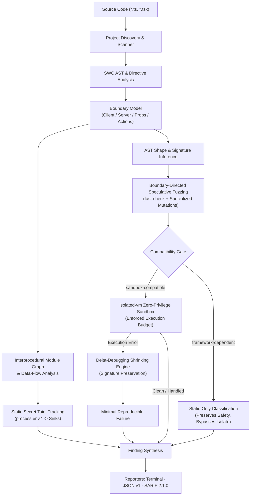

# SIS

### Speculative Invariant Synthesis

> What if your Next.js app could find the edge cases you forgot to test?

SIS is a zero-configuration analysis and speculative fuzzing tool for modern Next.js App Router and React Server Component boundaries. It discovers Client/Server module boundaries, traces secret data flows, models React Flight serializability contracts, synthesizes targeted adversarial payloads, and dynamically verifies invariants inside an isolated V8 execution sandbox.

[](https://github.com/AashirZayd/sis)
[](https://nodejs.org)
[](LICENSE)
[](test/)

[Website](https://aashirzayd.github.io/sis/) · [Guides](docs/server-actions-testing.md) · [FAQ](docs/faq.md) · [Architecture](docs/architecture.md) · [CLI Reference](#cli-reference) · [Examples](examples/) · [GitHub](https://github.com/AashirZayd/sis)

```bash
# Verify Server Actions and RSC boundaries across your Next.js project
npx @aashirzayd/sis audit .
```

---

## The Problem

Modern Next.js applications split application logic across Server Components, Client Components, and Server Actions. While happy-path unit and integration tests verify that features work when given expected inputs, production boundaries frequently encounter edge cases developers did not anticipate:

- **Unexpected Argument Shapes**: `null`, `undefined`, sparse arrays, and missing nested keys causing runtime `TypeError: Cannot read properties of undefined`.
- **Numeric Hazards**: Unchecked `NaN`, `-0`, `Infinity`, and precision loss propagating into downstream business logic or database queries.
- **Prototype-Sensitive Objects**: Payloads containing `__proto__` or `constructor` causing unexpected object behavior.
- **Serialization Traps**: Event handlers, custom class instances, and unregistered symbols crossing the Server $\to$ Client boundary and breaking React Flight wire transfer.
- **Secret Taint Leaks**: Private server environment variables (`process.env.AUTH_SECRET`) inadvertently forwarded into Client Component props or JSX sinks.
- **Nested Destructuring Failures**: Complex parameter unpacking failing violently when encountering empty objects or scalar values.

Traditional testing validates developer-written examples. **SIS asks:** *What happens when the boundary receives something you did not think to test?*

---

## Use Cases

- **Server Action Input Hardening**: Automatically fuzz public Server Action network endpoints with boundary-directed adversarial inputs (nullish values, prototype pollution keys, numeric extremes, and deep nesting).
- **React Flight Serializability Audits**: Detect non-transferable closures, custom class instances, and unregistered symbols before they trigger runtime React Flight transfer errors in production (`SIS002`).
- **Secret Taint & Leak Prevention**: Statically trace multi-hop call graphs from sensitive environment variables (`*_SECRET`, `*_KEY`, `DATABASE_URL`) to Client Component JSX sinks (`SIS001`).
- **CI/CD Quality Gates & Security Scanning**: Run deterministic audits in GitHub Actions or GitLab CI with native OASIS SARIF 2.1.0 output uploaded directly to GitHub Code Scanning.
- **Regression Testing with Minimal Repro**: Automatically reduce complex failing fuzz payloads to minimal, human-readable reproducers using delta-debugging.

---

## What SIS Actually Does

SIS analyzes your Next.js codebase through an integrated static and dynamic verification pipeline:



1. **AST & Boundary Discovery**: Uses `@swc/core` to parse TypeScript and TSX, identifying `"use client"` and `"use server"` directives, exported Server Actions, and component props.
2. **Interprocedural Data-Flow & Taint**: Constructs a local module call graph to trace sensitive environment variables across helper functions into Client boundaries.
3. **React Flight Serializability**: Evaluates props passed to Client Components against React Flight serialization specifications.
4. **Speculative Shape Inference**: Infers parameter shapes from TypeScript types, destructuring patterns, and property accesses.
5. **Boundary-Directed Fuzzing**: Synthesizes adversarial payloads targeting boundary hazards using `fast-check` and targeted mutation strategies.
6. **Isolated Runtime Verification**: Executes sandbox-compatible actions in an `isolated-vm` V8 isolate under an execution budget (default: 20ms).
7. **Failure-Preserving Shrinking**: Automatically delta-debugs failing payloads to the smallest reproducible input that triggers the identical error signature.
8. **Deterministic Reporting**: Formats results as actionable terminal output, Version 1 JSON, or OASIS SARIF 2.1.0.

---

## Why SIS Is Different

| Approach | What It Does | SIS Difference |
| :--- | :--- | :--- |
| **Unit tests** | Verify developer-written examples | SIS generates boundary-directed adversarial edge cases automatically. |
| **Generic fuzzing** | Explores arbitrary, untyped inputs | SIS targets discovered Next.js boundary contracts and inferenced shapes. |
| **Static analysis** | Identifies suspicious syntax patterns | SIS dynamically executes and verifies sandbox-compatible candidates in an isolate. |
| **Taint analysis** | Traces sensitive values to sinks | SIS combines interprocedural taint with React Server/Client boundary semantics. |
| **SIS** | Unifies boundary discovery, taint, fuzzing, and shrinking | Delivers verified, minimal reproducers for edge cases developers miss. |

> SIS does not replace your test suite or linter. It complements them by exploring boundary behaviors beyond your happy paths.

---

## Alternatives & Complementary Tools

SIS is not an all-in-one testing framework; it is a specialized boundary verification engine designed to complement your existing developer stack:

| Tool Category | Examples | Role & Relationship to SIS |
| :--- | :--- | :--- |
| **Unit & Component Testing** | Vitest, Jest, React Testing Library | **Complementary**. Vitest and Jest verify anticipated business logic and known happy paths. SIS complements them by exploring unanticipated boundary inputs and invariant breaks without manual test authoring. |
| **End-to-End (E2E) Testing** | Playwright, Cypress | **Complementary**. E2E frameworks verify complete full-stack user journeys in real browsers. SIS focuses strictly on the Server/Client module boundary and Server Action RPC surface in zero-privilege V8 isolates. |
| **Linters & Type Checkers** | ESLint, TypeScript | **Complementary**. TypeScript guarantees compile-time types across trusted internal code, but cannot prevent untrusted network payloads from reaching runtime Server Actions. SIS verifies runtime behavior against adversarial inputs. |
| **Generic Property-Based Fuzzers** | fast-check, jsverify | **Foundation**. SIS utilizes `fast-check` internally for primitive generation, but adds SWC AST parsing, Next.js boundary discovery, React Flight contract validation, isolated V8 execution sandboxing, and delta-debugging shrinking. |

---

## Documentation & In-Depth Guides

Explore authoritative deep dives on Next.js boundary security, architecture, and verification:

- [**Next.js Server Actions Testing Guide**](docs/server-actions-testing.md): Why unit tests miss boundary hazards, prototype pollution, destructuring traps, and how to verify action handlers.
- [**React Flight Serialization Hazards**](docs/serialization-boundaries.md): The React Flight wire protocol vs `JSON.stringify`, non-transferable closures, class instances, and `SIS002` diagnostics.
- [**Adversarial Invariant Synthesis & Fuzzing**](docs/adversarial-testing.md): Speculative shape inference, `fast-check` mutation strategies, zero-privilege V8 execution, and delta-debugging failure shrinking.
- [**Static Secret Taint Analysis**](docs/taint-analysis.md): Interprocedural data-flow tracing from sensitive environment variables to Client Component JSX sinks (`SIS001`).
- [**CI/CD Automation & SARIF Guide**](docs/ci-sarif.md): Integrating SIS into GitHub Actions Code Scanning, SARIF 2.1.0 ingestion, and exit code contracts.
- [**Frequently Asked Questions (FAQ)**](docs/faq.md): Direct answers on architecture, testing methodology, Server Actions vs Functions, and runtime constraints.
- [**Architecture Specification**](docs/architecture.md): Formal design specification of the 8-stage verification pipeline and boundary models.

---

## See It in Action

Consider a simple Server Action designed to calculate discounts:

```typescript
"use server";

export async function calculatePrice(value: number) {
  return value.toFixed(2);
}
```

Developers expect standard positive numbers. But what happens when unexpected values arrive across the network?

When audited, SIS synthesizes numeric edge cases (`0`, `-0`, `NaN`, `Infinity`, `-Infinity`, `null`, `undefined`), executes the candidate inside the V8 isolate, and shrinks the failing payload:

```text
$ npx @aashirzayd/sis audit app/actions/pricing.ts

SIS  Speculative Invariant Synthesis
Autonomous runtime verification for Next.js boundaries

◇ DISCOVERY
  Target: app/actions/pricing.ts (Single File)

Scanning 1 source file...

◆ DISCOVERY
  ✓ 1 server boundary
  ✓ 1 candidate Server Action

◆ SPECULATIVE FUZZING
  ◇ 1 boundary target discovered
  ⟳ 4 fuzz strategies applied
  ✓ 10 boundary-directed payloads

◆ RUNTIME VERIFICATION
  ✓ 6 passed
  ✖ 4 failed

  ✖ calculatePrice
    Payload #1
    Input: -Infinity
    RangeError: toFixed() digits argument must be between 0 and 100
    app/actions/pricing.ts:4

    Execution: 2ms / 20ms budget
    Wall time: 6ms

◆ FAILURE SHRINKING
  ✓ 4 failures reduced

  ✖ calculatePrice
    Original: -Infinity
    Minimal reproducer: -Infinity
    Attempts: 1
    Reduction: 0%
    Verification: ✓ failure preserved

────────────────────────────────────────
AUDIT COMPLETE
  Files analyzed:        1
  Server boundaries:     1
  Candidate actions:     1
  Runtime failures:      4
  Taint violations:      0

✖ SIS found 4 verified findings
────────────────────────────────────────
```

When encountering complex nested inputs, the shrinking engine systematically strips irrelevant properties:

```text
  ✖ processOrder
    Original: { user: { profile: { accountId: null, role: "admin" } }, tags: ["urgent"] }
    Minimal reproducer: { user: { profile: { accountId: null } } }
    Attempts: 3
    Reduction: 73.1%
    Verification: ✓ failure preserved
```

---

## Boundary Awareness

SIS models the full spectrum of Next.js App Router boundary semantics:

- **Client Modules**: Files marked with top-level `"use client"`.
- **Server Modules**: Files marked with top-level `"use server"`.
- **Server Components**: Default React components in App Router executed on the server.
- **Server Actions**: Async functions explicitly callable from the client, designated via module-level or inline `"use server"` directive prologues.
- **Server Functions**: General server-side utility functions. *Not every Server Function is a Server Action.*
- **Server-to-Client Props**: Prop expressions passed from Server Components into Client Components (`<ClientComponent prop={value} />`).

Boundary semantics determine where adversarial inputs and invariants matter. Server Actions require fuzzing and parameter validation; Client Component boundaries require serializability and secret taint checks.

---

## React Flight Serialization

React Server Components transfer data over the wire using the React Flight protocol. Props passed from Server Components to Client Components, as well as return values from Server Actions, must be transferable.

```
JSON.stringify semantics  ≠  React Flight semantics
```

SIS inspects boundary expressions against React Flight specifications:

- **Supported Built-ins**: Primitives (`string`, `number`, `boolean`, `null`, `undefined`), `Date`, `Map`, `Set`, `ArrayBuffer`, typed arrays (`Uint8Array`, etc.), plain objects, arrays, and functions with `"use server"`.
- **Unsupported Hazards**:
  - Ordinary functions and closures without `"use server"` (e.g. `onClick={() => {}}` passed from a Server Component).
  - Custom class instances (e.g. `new DatabaseClient()`, `new UserSession()`).
  - Unregistered `Symbol()` identifiers.
  - Circular and non-transferable data structures.

When non-transferable values cross boundaries, SIS emits `SIS002: serialization-violation`.

---

## Static Taint Analysis

SIS tracks sensitive server environment variables through AST data flows and interprocedural helper chains until they reach a boundary:

```text
process.env.AUTH_SECRET  ──>  getSessionSecret()  ──>  <UserProfile secret={...} />
```

- **Sensitive Sources**: Automatically matches environment variables matching `*_KEY`, `*_SECRET`, `*_TOKEN`, `*_PASSWORD`, `PRIVATE_*`, and `SECRET_*`.
- **Safe Variables**: Public environment variables (`NEXT_PUBLIC_*`) are explicitly recognized as safe and excluded from taint tracking.
- **Sinks**: Direct assignments, object literals, array elements, and template strings reaching `"use client"` boundaries or JSX expressions.

If a sensitive flow is detected, SIS reports a static `SIS001: taint-violation` with source location and trace details.

---

## Isolated Runtime Verification

When candidate Server Actions are identified, SIS evaluates their execution compatibility:

- **Sandbox-Compatible**: Self-contained functions without host dependencies or unresolved external imports. These are executed directly inside an `isolated-vm` V8 isolate.
- **Static-Only**: Functions that depend on external infrastructure (Next.js `cookies()`, `headers()`, `redirect()`, `notFound()`, database connections, ORMs, or network sockets).

```text
Framework-dependent action
        ↓
    cookies()
        ↓
   static-only
        ↓
Static analysis continues
Runtime isolate skipped
```

> **Why this matters**: `isolated-vm` provides a secure, zero-privilege execution sandbox without access to `process`, `fs`, `fetch`, or host environment variables. SIS does not claim to be a full Next.js runtime. Bypassing isolate execution for framework-dependent functions prevents false-positive crashes while verifying pure logic safely.

---

## Failure Shrinking

When a synthesized payload triggers a runtime failure, raw property-based inputs are often noisy and complex. SIS invokes a failure-preserving delta-debugging shrinker:

```text
Complex failing payload
        ↓
Capture failure signature (action + error name + message pattern)
        ↓
Systematically strip properties / simplify scalar values
        ↓
Verify candidate in sandbox (re-check failure signature)
        ↓
Smallest useful failing payload (Minimal Reproducer)
```

If a reduced payload fails to reproduce the exact original failure signature, the shrinker discards it and preserves the verified parent state.

---

## Determinism & Reproducibility

SIS guarantees reproducible audits:

```bash
npx @aashirzayd/sis audit app/ --seed 42
```

Specifying a seed produces deterministic results across runs:
- **Lexicographical File Ordering**: Directory discovery sorts files consistently across operating systems.
- **Per-File Seed Derivation**: Each file receives a deterministic seed derived via 32-bit FNV-1a hashing of the base seed and relative file path.
- **Deterministic Payload Generation**: The underlying `fast-check` PRNG produces identical payloads.
- **Reproducible Repro Payloads**: Failure signatures and minimal reproducers match across runs.

*(Note: While findings and payloads are deterministic, execution timing measurements naturally vary depending on system hardware).*

---

## Performance & Scaling

SIS enforces a linear budget model:

```text
Total Payloads  =  Targets (T)  ×  Runs (N)
```

The `--runs` option defines the quota **per candidate target**, rather than a global pool:

- **10 targets** $\times$ `--runs 10` = 100 synthesized payloads.
- **100 targets** $\times$ `--runs 10` = 1,000 synthesized payloads.
- **100 targets** $\times$ `--runs 100` = 10,000 synthesized payloads.

This per-target allocation prevents combinatorial explosion ($O(T \cdot N)$ rather than $O(T \cdot N \cdot S)$), ensuring predictable memory and execution time across large projects.

*(Example benchmark on local developer hardware: 20 targets audit in ~0.8s; 100 targets audit in ~3.5s. Exact timings depend on host machine specifications).*

---

## Installation

Run SIS on-demand using `npx`:

```bash
npx @aashirzayd/sis audit .
```

Or add it to your project's development dependencies:

```bash
npm install --save-dev @aashirzayd/sis
```

Once installed locally, you can invoke the executable directly:

```bash
sis audit .
```

### System Requirements

- **Node.js**: `>= 24.0.0`
- **Module System**: ESM (ECMAScript Modules)
- **Target Projects**: Next.js App Router applications (TypeScript or JavaScript)

---

## CLI Reference

```bash
# Using npx
npx @aashirzayd/sis audit [target] [options]

# Or using the locally installed binary
sis audit [target] [options]
```

### Common Commands

```bash
# Audit entire repository
npx @aashirzayd/sis audit .

# Audit a specific Server Action or component file
npx @aashirzayd/sis audit app/actions/checkout.ts
npx @aashirzayd/sis audit app/components/Card.tsx

# Emit machine-readable JSON or SARIF to stdout
npx @aashirzayd/sis audit . --json > sis-report.json
npx @aashirzayd/sis audit . --sarif > sis-results.sarif

# Run silently in CI scripts (exit code only)
npx @aashirzayd/sis audit . --silent

# Configure fuzzing budget and deterministic seed
npx @aashirzayd/sis audit . --runs 25 --seed 42 --timeout 50
```

### Options

| Category | Option | Description | Default |
| :--- | :--- | :--- | :--- |
| **Audit** | `<target>` | Path to target project, directory, or individual source file. | *(Required)* |
| | `--ignore <patterns...>` | Additional directories or file patterns to ignore. | `[]` |
| | `--max-analysis-depth <n>` | Maximum call-depth for interprocedural analysis. | `8` |
| **Output** | `-f, --format <format>` | Output format: `terminal`, `json`, or `sarif`. | `"terminal"` |
| | `--json` | Emit output as machine-readable JSON (alias for `--format json`). | `false` |
| | `--sarif` | Emit output as OASIS SARIF 2.1.0 (alias for `--format sarif`). | `false` |
| | `--silent` | Suppress human-readable terminal progress and output. | `false` |
| **Execution** | `-r, --runs <n>` | Number of synthesized payloads allocated per candidate target. | `10` |
| | `-t, --timeout <ms>` | Candidate JavaScript execution budget inside the isolate in ms. | `20` |
| | `--no-shrink` | Disable automatic failure shrinking. | `false` |
| | `--max-shrink-attempts <n>` | Maximum shrinking iterations per failing payload. | `30` |
| **Reproducibility** | `-s, --seed <n>` | Explicit seed for deterministic synthesis and file ordering. | `Date.now()` |
| **Global** | `--debug` | Display verbose diagnostics and error stack traces. | `false` |
| | `-v, --version` | Display current SIS version. | |
| | `-h, --help` | Display command help. | |

> **Execution Timeout Semantics (`--timeout <ms>`)**:
> The `--timeout` option configures the **maximum execution budget for candidate JavaScript execution inside the V8 isolate**. It is NOT total audit wall-clock time. Host AST parsing, payload synthesis, isolate spinup, and teardown are not deducted from this budget.

### Exit Code Contract

| Exit Code | Classification | Description |
| :---: | :--- | :--- |
| **`0`** | **Clean Audit** | Audit completed successfully with zero actionable findings or invariant violations. |
| **`1`** | **Violations Detected** | Actionable findings detected (taint leaks, runtime exceptions, timeouts, or serialization errors). |
| **`2`** | **CLI / Config Error** | Target path not found, invalid numeric option (`--runs <= 0`), conflicting output flags, or malformed arguments. |
| **`3`** | **Engine Failure** | Unexpected internal executor or isolate failure. |
| **`130`** | **Interrupted** | Execution canceled by user via `SIGINT` (`Ctrl+C`). |
| **`143`** | **Terminated** | Execution terminated via `SIGTERM`. |

---

## Findings Catalog

SIS assigns persistent, stable rule identifiers:

| Rule ID | Name | Mode | Severity | Description |
| :---: | :--- | :---: | :---: | :--- |
| **`SIS001`** | `taint-violation` | Static | `error` | Sensitive server environment variable flows into a Client boundary. |
| **`SIS002`** | `serialization-violation` | Static | `error` | Non-transferable value crosses React Flight boundary. |
| **`SIS003`** | `runtime-exception` | Runtime | `error` | Candidate Server Action threw an unhandled runtime exception. |
| **`SIS004`** | `timeout` | Runtime | `error` | Candidate Server Action exceeded its allocated execution budget. |
| **`SIS005`** | `invariant-violation` | Dynamic / Static | `error` | Boundary invariant assertion violated during execution. |

### Rule Details

#### `SIS001`: Taint Violation
- **Meaning**: Server-side credentials or secrets are accessible in a Client Component or returned to client code.
- **Example**: `const key = process.env.API_SECRET; return <div>{key}</div>;` inside `"use client"`.
- **Remediation**: Remove secret references from Client Components. Access secrets only inside server-only modules or Server Actions without returning them.

#### `SIS002`: Serialization Violation
- **Meaning**: A Server Component passes a prop to a Client Component that cannot be serialized over React Flight.
- **Example**: `<ClientButton onClick={() => doServerWork()} />` where `onClick` is an ordinary server function without `"use server"`.
- **Remediation**: Convert the handler to a Server Action with `"use server"`, or pass serializable primitive identifiers.

#### `SIS003`: Runtime Exception
- **Meaning**: An exported Server Action threw an uncaught error (such as `TypeError` or `RangeError`) when invoked with boundary edge cases.
- **Example**: `export async function update(data) { return data.user.id; }` fails when `data` is `null`.
- **Remediation**: Implement defensive parameter validation at the top of the Server Action (e.g. using Zod, ArkType, or explicit guards).

#### `SIS004`: Timeout
- **Meaning**: An action entered an infinite loop or exceeded its isolate execution budget.
- **Example**: `while (condition) { ... }` without an exit condition.
- **Remediation**: Check loop termination conditions and bound recursion depth.

#### `SIS005`: Invariant Violation
- **Meaning**: A synthesized boundary invariant was breached during analysis or execution.
- **Remediation**: Review the specific failure diagnostic reported in the audit findings.

---

## Machine-Readable Output & CI

### Stream Discipline
When `--json` or `--sarif` is specified, SIS enforces strict stream separation:
- **`stdout`**: Reserved strictly for valid JSON or SARIF.
- **`stderr`**: Receives all diagnostic notices, progress banners, and error boxes.

Piping stdout to a file will never produce corrupted JSON:

```bash
npx @aashirzayd/sis audit . --json > sis-report.json
npx @aashirzayd/sis audit . --sarif > sis-results.sarif
```

### GitHub Actions Workflow

Integrate SIS into GitHub Actions to scan pull requests and publish findings directly to GitHub Security Code Scanning:

```yaml
name: SIS Security Audit

on:
  push:
    branches: [main]
  pull_request:
    branches: [main]

jobs:
  audit:
    runs-on: ubuntu-latest
    permissions:
      security-events: write
      contents: read
    steps:
      - name: Checkout repository
        uses: actions/checkout@v4

      - name: Setup Node.js
        uses: actions/setup-node@v4
        with:
          node-version: 24

      - name: Install dependencies
        run: npm ci

      - name: Run SIS Audit
        run: npx @aashirzayd/sis audit . --sarif > sis-results.sarif
        continue-on-error: true

      - name: Upload SARIF to GitHub Code Scanning
        uses: github/codeql-action/upload-sarif@v3
        with:
          sarif_file: sis-results.sarif
```

---

## Limitations

To maintain technical precision and credibility, SIS explicitly identifies its architectural boundaries:

1. **Not a Full Next.js Runtime**: SIS uses `isolated-vm` to execute JavaScript in a clean V8 isolate. It does not run a mock Next.js server, emulate the React reconciler, or provide Next.js routing infrastructure.
2. **Static-Only for Framework Globals**: Actions requiring live Next.js request context (`cookies()`, `headers()`, `redirect()`, `notFound()`) or external database connections are classified as `static-only` and safely skipped from isolate execution.
3. **Flight Modeling vs Bundler Emulation**: React Flight serializability is modeled against published protocol specifications; it does not invoke React's internal webpack flight client/server plugin.
4. **Targeted Fuzzing vs Formal Proof**: Speculative invariant synthesis generates targeted boundary payloads. Passing an audit verifies that tested invariants held against synthesized inputs; it is not a mathematical proof of absolute security.
5. **Static Taint Reach**: Static analysis operates over discoverable local module graphs. Dynamic evaluation (`eval()`, dynamically constructed `import()`, or obfuscated property access) cannot be tracked.

---

## Roadmap

SIS is developed in rigorous, phased milestones:

- [x] **Phase 1 — Foundation & CLI Shell**: Core contracts, Commander CLI, terminal presenter.
- [x] **Phase 2 — SWC AST & Boundary Discovery**: Parser, `"use client"`/`"use server"` discovery, source mapping.
- [x] **Phase 3 — Static Taint Analysis**: Sensitive environment variable tracking across AST flows.
- [x] **Phase 4 — Property-Based Payload Synthesis**: Adversarial inputs powered by `fast-check`.
- [x] **Phase 5 — Isolated Runtime Execution**: Zero-privilege `isolated-vm` sandbox with execution budgets.
- [x] **Phase 6 — Failure Shrinking & Minimization**: Delta-debugging engine preserving failure signatures.
- [x] **Phase 7 — Directory Auditing & CLI Experience**: Recursive scanning, FNV-1a seeding, exit code contract.
- [x] **Phase 8 — Machine-Readable JSON & SARIF**: JSON schema v1, OASIS SARIF 2.1.0, stream separation.
- [x] **Phase 9 — Interprocedural Data Flow**: Multi-hop module call graphs, cycle-safe analysis depth.
- [x] **Phase 10 — Next.js Boundary Semantics**: Fine-grained boundary classification, React Flight modeling.
- [x] **Phase 11 — Boundary-Aware Speculative Fuzzing**: Type-directed shape inference, targeted mutations.
- [x] **Phase 12 — Real-World Hardening**: Validation against 11 real-world adversarial fixture suites.
- [x] **Phase 13 — Performance & Determinism**: Linear $O(T \cdot N)$ scaling, byte-for-byte seed reproducibility.
- [x] **Phase 14 — CLI/UX & Error Handling Polish**: Input validation, flag aliases, signal handling.
- [x] **Phase 15 — Documentation & GitHub Excellence**: Authoritative technical documentation, architecture specs, and curated examples.
- [ ] **Phase 16 — Automated Invariant Remediation**: Automated boundary decorators and patch generation.

---

## Development & Testing

```bash
# Install dependencies
npm install

# Build TypeScript
npm run build

# Run test suite (205 tests across 14 suites)
npm test

# Run tests in watch mode
npm run test:watch
```

---

## License

MIT © 2026 Aashir Zayd. See [LICENSE](LICENSE) for details.
