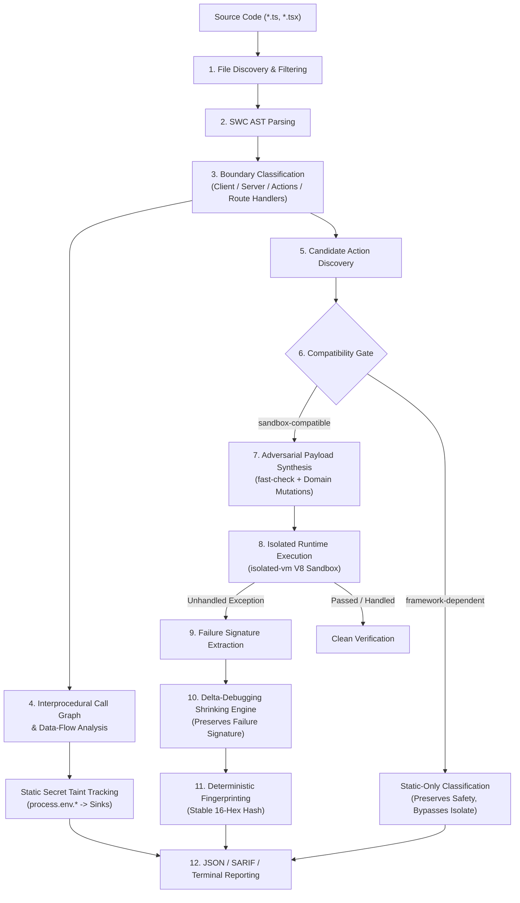

# SIS

### Speculative Invariant Synthesis

> What if your Next.js application could automatically invent the malformed inputs you forgot to test?

SIS is **Speculative Invariant Synthesis** — autonomous runtime verification and adversarial testing for Next.js Server Actions and React Server Component boundaries.

SIS statically discovers relevant boundaries and uses deterministic adversarial input generation combined with runtime verification inside zero-privilege V8 isolates where the target is compatible with the sandbox.

[](https://github.com/AashirZayd/sis)
[](https://nodejs.org)
[](LICENSE)
[](test/)

[Website](https://aashirzayd.github.io/sis/) · [Benchmark Methodology](docs/benchmark.md) · [Architecture Specification](docs/architecture.md) · [Known Limitations](benchmarks/KNOWN_LIMITATIONS.md) · [CLI Reference](#cli-reference) · [Examples](examples/) · [GitHub](https://github.com/AashirZayd/sis)

```bash
# Verify Server Actions and RSC boundaries across your Next.js project
npx @aashirzayd/sis audit .
```

---

## Core Philosophy: Proof Over Suspicion

Traditional linters and static analysis tools produce warnings based on pattern suspicion, often burying engineers in unverified false alarms. Generic property-based fuzzers generate untyped noise with no awareness of framework module boundaries.

SIS is built on **proof over suspicion**:
- **Static Analysis Identifies Candidates**: Discovers Server Action entry points, traces interprocedural data flows, and identifies potential secret leaks or serialization hazards.
- **Dynamic Verification Confirms Executable Failures**: Where an action is sandbox-compatible, SIS executes candidate inputs in an isolated V8 sandbox (`isolated-vm`). An invariant failure is only confirmed when the function actively throws or violates boundary contracts at runtime.
- **Unsupported Runtime Dependencies Are Not Treated as Application Failures**: Functions requiring external infrastructure (Next.js request cookies, headers, database connections, or cloud SDKs) are classified as `static-only` and safely bypassed by the runtime sandbox, preventing spurious crash reports.

> **What SIS Is Not**:
> - SIS is **not** a general-purpose security scanner.
> - SIS is **not** a vulnerability scanner that guarantees security.
> - SIS is **not** a replacement for unit, integration, or end-to-end tests.
> - SIS is **not** a complete Next.js server runtime or React reconciler emulator.
> - SIS is **not** a complete React Flight implementation.
> - SIS is **not** a production exploit detector or network penetration tool.
> - SIS is **not** an AI security tool.
> - Passing an audit proves that tested invariants held against synthesized inputs; it does not provide a mathematical guarantee that zero latent bugs exist.

---

## The Problem

Modern Next.js applications split application logic across Server Components, Client Components, and Server Actions. While happy-path unit and integration tests verify that features work when given expected inputs, production boundaries frequently encounter edge cases developers did not anticipate:

- **Unexpected Argument Shapes**: `null`, `undefined`, sparse arrays, and missing nested keys causing runtime `TypeError: Cannot read properties of undefined`.
- **Numeric Hazards**: Unchecked `NaN`, `-0`, `Infinity`, and precision loss propagating into downstream business logic or database queries.
- **Prototype-Sensitive Objects**: Payloads containing `__proto__` or `constructor` causing unexpected object behavior.
- **Serialization Traps**: Event handlers, custom class instances, and unregistered symbols crossing the Server $\to$ Client boundary and breaking React Flight wire transfer.
- **Secret Taint Leaks**: Private server environment variables (`process.env.AUTH_SECRET`) inadvertently forwarded into Client Component props or JSX sinks.
- **Nested Destructuring Failures**: Complex parameter unpacking failing violently when encountering empty objects or scalar values.

Traditional testing validates developer-written examples. **SIS asks:** *What happens when the boundary receives something you did not think to test?*

---

## Use Cases

- **Server Action Input Hardening**: Automatically fuzz public Server Action network endpoints with boundary-directed adversarial inputs (nullish values, prototype pollution keys, numeric extremes, and deep nesting).
- **React Flight Serializability Audits**: Detect non-transferable closures, custom class instances, and unregistered symbols before they trigger runtime React Flight transfer errors in production (`SIS002`).
- **Secret Taint & Leak Prevention**: Statically trace multi-hop call graphs from sensitive environment variables (`*_SECRET`, `*_KEY`, `DATABASE_URL`) to Client Component JSX sinks (`SIS001`).
- **CI/CD Quality Gates & Security Scanning**: Run deterministic audits in GitHub Actions or GitLab CI with native OASIS SARIF 2.1.0 output uploaded directly to GitHub Code Scanning.
- **Regression Testing with Minimal Repro**: Automatically reduce complex failing fuzz payloads to minimal, human-readable reproducers using delta-debugging.

---

## What SIS Finds

SIS classifies boundary findings under five persistent, stable rule identifiers. **A finding represents an invariant failure or boundary contract violation; it is not automatically an exploitable security vulnerability or CVE.**

| Rule ID | Name | Mode | Category | What the Output Represents & Caveats |
| :---: | :--- | :---: | :---: | :--- |
| **`SIS001`** | `taint-violation` | Static | Data Flow | **Private server secret flows to client boundary.** Traces sensitive server environment variables (`*_SECRET`, `*_KEY`, `*_TOKEN`) through local module call graphs to Client Components. *Caveat*: Operates over discoverable AST syntax; dynamic `eval()` or obfuscated property access cannot be tracked. |
| **`SIS002`** | `serialization-violation` | Static | Wire Protocol | **Non-transferable value crosses React Flight boundary.** Identifies closures without `"use server"`, custom class instances, or unregistered symbols passed across Server $\to$ Client component props. *Caveat*: Modeled against React Flight protocol specifications; HTTP Route Handlers are explicitly excluded. |
| **`SIS003`** | `runtime-exception` | Runtime | Boundary Crash | **Exported Server Action threw an unhandled runtime exception.** Triggered when synthesized adversarial inputs cause uncaught errors (e.g. `TypeError`, `RangeError`). *Caveat*: Only verified for sandbox-compatible actions in `isolated-vm`; external host dependencies trigger safe static fallback. |
| **`SIS004`** | `timeout` | Runtime | Execution Budget | **Server Action exceeded its allocated execution budget.** Triggered when an action enters an infinite loop or exceeds its per-execution timeout (default: 20ms). *Caveat*: Bounded specifically to isolate JavaScript execution, not host audit wall time. |
| **`SIS005`** | `invariant-violation` | Dynamic / Static | Boundary Contract | **Boundary invariant assertion violated during execution.** Custom or synthesized boundary preconditions failed. *Caveat*: Invariants reflect synthesized shape expectations and contracts. |

---

## What SIS Actually Does

SIS analyzes your Next.js codebase through an integrated 12-stage static and dynamic verification pipeline:



### The 12-Stage Pipeline

1. **File Discovery**: Discovers TypeScript and JavaScript source files while respecting `.gitignore`, build directories (`.next`, `dist`), and non-production test suites (`playwright/`, `e2e/`, `__tests__/`).
2. **AST Parsing**: Parses source trees into `@swc/core` ASTs, preserving source spans and symbol bindings.
3. **Boundary Classification**: Classifies modules and components based on `"use client"` and `"use server"` directives, React client hook usage, and Next.js route conventions.
4. **Interprocedural Call Graph & Data Flow**: Constructs intra-module call graphs to trace data flow through intermediate helper functions and re-exports.
5. **Candidate Action Discovery**: Identifies exported async functions inside `"use server"` modules or functions with inline `"use server"` prologues.
6. **Compatibility Classification**: Evaluates candidate actions against host dependencies. Functions using Next.js request context (`cookies()`, `headers()`) or external cloud SDKs are classified as `static-only`.
7. **Adversarial Payload Synthesis**: Generates targeted boundary edge cases (nullish values, prototype keys, numeric extremes, boundary-crossing shapes) powered by `fast-check` and specialized mutators.
8. **Isolated Runtime Execution**: Executes sandbox-compatible actions in an `isolated-vm` V8 isolate under an enforced CPU budget (default: 20ms).
9. **Failure Signature Extraction**: When an execution fails, extracts a normalized failure signature (action name, error constructor, and message pattern).
10. **Delta Debugging & Shrinking**: Systematically strips extraneous object properties and reduces primitive values while ensuring each intermediate candidate reproduces the identical failure signature.
11. **Deterministic Fingerprinting**: Computes an immutable 16-character hexadecimal fingerprint using 64-bit FNV-1a hashing over repository, commit, file path, rule ID, line, and normalized failure signature.
12. **Structured Reporting**: Emits findings formatted for interactive terminal review, machine-readable JSON Schema v1, or OASIS SARIF 2.1.0 for CI/CD ingestion.

---

## Why SIS Is Different

| Capability | Generic Linters / SAST | Generic Property Fuzzers | SIS Approach |
| :--- | :--- | :--- | :--- |
| **Boundary Awareness** | Syntax pattern matching | Untyped random inputs | Understands Next.js App Router, `"use client"`, `"use server"`, and React Flight semantics. |
| **Verification Model** | Heuristic warnings (high noise) | Generates test cases | **Proof over suspicion**: Static analysis finds candidates; runtime V8 isolate confirms crashes. |
| **Property Generation** | None | `fast-check` / `jsverify` | Builds Next.js-aware shape inference and domain mutations directly on top of `fast-check`. |
| **Runtime Isolation** | None (does not execute) | Host Node.js process | Zero-privilege V8 isolate (`isolated-vm`) with strict CPU timeouts and zero host system access. |
| **Failure Reduction** | None | Generic value shrinking | Failure-preserving delta-debugging that guarantees the shrunk input reproduces the exact failure signature. |
| **False-Positive Control** | Rule suppressions | None | **Compatibility Gate**: Cloud SDKs and request globals fall back to `static-only` rather than throwing sandbox errors. |
| **Audit Reproducibility** | Depends on file order | Pseudo-random seeds | 32-bit FNV-1a seed derivation per file ensures identical payloads across runs under equivalent environments. |
| **CI/CD Integration** | Proprietary formats | Raw test logs | Native OASIS SARIF 2.1.0 output uploaded directly to GitHub Code Scanning. |

---

## Alternatives & Complementary Tools

SIS is not an all-in-one testing framework; it is a specialized boundary verification engine designed to complement your existing developer stack:

| Tool Category | Examples | Role & Relationship to SIS |
| :--- | :--- | :--- |
| **Unit & Component Testing** | Vitest, Jest, React Testing Library | **Complementary**. Vitest and Jest verify anticipated business logic and known happy paths. SIS complements them by exploring unanticipated boundary inputs and invariant breaks without manual test authoring. |
| **End-to-End (E2E) Testing** | Playwright, Cypress | **Complementary**. E2E frameworks verify complete full-stack user journeys in real browsers. SIS focuses strictly on the Server/Client module boundary and Server Action RPC surface in zero-privilege V8 isolates. |
| **Linters & Type Checkers** | ESLint, TypeScript | **Complementary**. TypeScript guarantees compile-time types across trusted internal code, but cannot prevent untrusted network payloads from reaching runtime Server Actions. SIS verifies runtime behavior against adversarial inputs. |
| **Generic Property-Based Fuzzers** | fast-check, jsverify | **Foundation**. SIS utilizes `fast-check` internally for primitive generation, but adds SWC AST parsing, Next.js boundary discovery, React Flight contract validation, isolated V8 execution sandboxing, and delta-debugging shrinking. |

---

## Documentation & In-Depth Guides

Explore authoritative deep dives on Next.js boundary security, architecture, and verification:

- [**Next.js Server Actions Testing Guide**](docs/server-actions-testing.md): Why unit tests miss boundary hazards, prototype pollution, destructuring traps, and how to verify action handlers.
- [**React Flight Serialization Hazards**](docs/serialization-boundaries.md): The React Flight wire protocol vs `JSON.stringify`, non-transferable closures, class instances, and `SIS002` diagnostics.
- [**Adversarial Invariant Synthesis & Fuzzing**](docs/adversarial-testing.md): Speculative shape inference, `fast-check` mutation strategies, zero-privilege V8 execution, and delta-debugging failure shrinking.
- [**Static Secret Taint Analysis**](docs/taint-analysis.md): Interprocedural data-flow tracing from sensitive environment variables to Client Component JSX sinks (`SIS001`).
- [**CI/CD Automation & SARIF Guide**](docs/ci-sarif.md): Integrating SIS into GitHub Actions Code Scanning, SARIF 2.1.0 ingestion, and exit code contracts.
- [**Frequently Asked Questions (FAQ)**](docs/faq.md): Direct answers on architecture, testing methodology, Server Actions vs Functions, and runtime constraints.
- [**Architecture Specification**](docs/architecture.md): Formal design specification of the 12-stage verification pipeline and boundary models.
- [**Benchmark & Evaluation Methodology**](docs/benchmark.md): Comprehensive empirical evaluation over 5 pinned open-source Next.js applications, ground-truth review catalog, and precision mathematics.

---

## Trust Model

SIS structures findings across three distinct levels of evidence:

```
[Level 1: Static Evidence]
  ↳ SWC AST inspection, interprocedural taint flow, and React Flight prop modeling.
  ↳ Flags potential secret leaks (SIS001) or non-transferable wire props (SIS002).

[Level 2: Dynamic Evidence]
  ↳ Zero-privilege isolated-vm V8 execution under strict CPU timeout budgets.
  ↳ Confirms that a synthesized adversarial input triggers an unhandled runtime crash (SIS003) or timeout (SIS004).

[Level 3: Reproduction Evidence]
  ↳ Delta-debugging minimizes the payload to its smallest reproducible form.
  ↳ Computes a deterministic 16-character fingerprint reproducible via `npm run benchmark -- --reproduce <fingerprint>`.
```

> **The Core Rule of SIS Trust**:
> A static suspicion is not equivalent to a verified runtime failure. An `isolated-vm` execution failure caused by missing host infrastructure (e.g. un-mocked database connections or cloud SDKs) is treated as a compatibility limit and classified as `static-only` — **never as an application defect**.

---

## Real-World Benchmark

To measure real-world boundary discovery and runtime verification without marketing exaggeration, SIS is evaluated against an automated, pinned benchmark corpus of authentic open-source Next.js applications:

> **43 findings reviewed. 9 confirmed true positives. 9 false positives. 24 framework artifacts. 1 unreachable test utility.**  
> **We publish the misses, not just the hits.**

For complete methodology, raw benchmark outputs, and reproduction instructions, see [**docs/benchmark.md**](docs/benchmark.md).

### Pinned Evaluation Corpus

The benchmark evaluates 5 authentic Next.js applications pinned at immutable Git commit SHAs:

| Repository | Pinned Commit | Application Type & Architecture | Files Analyzed | Server Boundaries | Server Actions |
| :--- | :---: | :--- | :---: | :---: | :---: |
| [**`shadcn-ui/taxonomy`**](https://github.com/shadcn-ui/taxonomy) | [`298a885`](https://github.com/shadcn-ui/taxonomy/tree/298a8857c7128a0d121e7f699dfd729f23b3966d) | Next.js App Router reference app with Contentlayer markdown, Stripe webhooks, and Prisma ORM. | 127 | 48 | 0 |
| [**`leerob/site`**](https://github.com/leerob/site) | [`fd03371`](https://github.com/leerob/site/tree/fd03371e3c90481a8447904e1b548e4c0327b7db) | High-fidelity personal site built by VP of DevRel with pure App Router patterns and Postgres queries. | 4 | 0 | 0 |
| [**`vercel/commerce`**](https://github.com/vercel/commerce) | [`3761e52`](https://github.com/vercel/commerce/tree/3761e52e60df9c6a316e067dbfd7032e494d3634) | Official Vercel Next.js Commerce architecture template exercising Shopify cart Server Actions. | 65 | 17 | 5 |
| [**`dubinc/dub`**](https://github.com/dubinc/dub) | [`b8866f4`](https://github.com/dubinc/dub/tree/b8866f413cec065438d6e5faabbd9dac7d1ceea5) | Enterprise link management platform with multi-tenant App Router, Zod schemas, and Prisma ORM. | 3,421 | 1,587 | 11 |
| [**`mickasmt/next-saas-stripe-starter`**](https://github.com/mickasmt/next-saas-stripe-starter) | [`a78d130`](https://github.com/mickasmt/next-saas-stripe-starter/tree/a78d130af7e04d0250d65c67f217976f7eb3adc2) | Production SaaS foundation with Stripe webhooks, user settings Server Actions, and NextAuth. | 187 | 78 | 4 |
| **Corpus Total** | — | **5 Authentic Next.js Codebases** | **3,804** | **1,730** | **20** |

*Note: These five repositories serve as an evaluation corpus exercising diverse Next.js patterns. They are not a universally representative statistical sample of all Next.js applications worldwide.*

---

### Current Pinned Benchmark Results (Phase 24)

Audited with base seed `42`, runs `10`, timeout `20ms`, Node.js `v24.19.0`, Windows `x64`:

| Metric | Result |
| :--- | :---: |
| **Target Repositories Evaluated** | **5 / 5 Pass** |
| **Total Source Files Discovered** | 5,362 |
| **Production Source Files Analyzed** | 3,804 |
| **Server Boundaries Discovered** | 1,730 |
| **Candidate Server Actions Identified** | 20 |
| **SIS001 (Static Secret Taint)** | 0 |
| **SIS002 (React Flight Serialization)** | 0 |
| **SIS003 (Runtime Exceptions)** | 9 |
| **SIS004 (Execution Timeouts)** | 0 |
| **SIS005 (Boundary Invariant Breaches)** | 0 |
| **Total Verified Findings Emitted** | **9** |
| **Internal Analysis Errors** | **0** |
| **Total Benchmark Wall Time** | **32.20s** |

---

### Ground-Truth Evaluation & Review Store

To establish empirical precision, every benchmark finding is recorded in an immutable, auditable review catalog ([`benchmarks/reviews/ground-truth.json`](benchmarks/reviews/ground-truth.json)) and classified by human code review against the pinned source code:

| Classification | Records | Percentage | Description |
| :--- | :---: | :---: | :--- |
| **`TRUE_POSITIVE`** | **9** | **20.9%** | Genuine boundary robustness defects confirmed by manual inspection. |
| **`FALSE_POSITIVE`** | **9** | **20.9%** | Precision failures identified and addressed during benchmark hardening. |
| **`FRAMEWORK_ARTIFACT`** | **24** | **55.8%** | Sandbox execution failures caused by un-mocked cloud singletons. |
| **`UNREACHABLE`** | **1** | **2.3%** | Non-production test utility helper scanned as production code. |
| **`EXPECTED_BEHAVIOR`**| **0** | **0.0%** | Expected boundary rejection behavior. |
| **`NEEDS_REVIEW`** | **0** | **0.0%** | **100% review coverage** across all 43 historical findings. |

---

### Benchmark Evolution: Phases 22 → 23 → 24

The benchmark was not constructed to showcase artificial success. It was used as an empirical instrument to expose engine flaws and measure systematic hardening:

| Evaluation Phase | Emitted Findings | True Positives | False Positives | Framework Artifacts | Active Emitted Precision | Wall Time | Main Milestone |
| :--- | :---: | :---: | :---: | :---: | :---: | :---: | :--- |
| **Phase 22 (Pilot)** | 43 | 2 (pilot sample) | 4 | 3 | 33.3% (pilot sample) | 41.10s | Benchmark exposed systematic boundary and runtime false positives. |
| **Phase 23 (Hardened)** | 9 | 2 (pilot sample) | 0 | 0 | 100.0% (emitted) | 30.29s | Boundary classification and Compatibility Gate removed systematic noise. |
| **Phase 24 (Comprehensive)** | 9 | **9 (all confirmed)** | 0 | 0 | **100.0% (emitted)** | 32.20s | Complete ground-truth review confirmed all active findings as genuine bugs. |

---

### Benchmark Precision Mathematics

We report empirical precision using explicit mathematical formulations:

1. **Current Emitted Benchmark Precision**:
   $$\text{Precision}_{\text{emitted}} = \frac{TP_{\text{emitted}}}{TP_{\text{emitted}} + FP_{\text{emitted}}} = \frac{9}{9 + 0} = \mathbf{100.0\%}$$
   *On the current pinned benchmark output, all 9 emitted findings were manually confirmed as true positives on `vercel/commerce`. This is benchmark-sample precision only and is not a universal production accuracy guarantee.*

2. **Lifetime Binary Review Precision**:
   $$\text{Precision}_{\text{lifetime}} = \frac{TP}{TP + FP} = \frac{9}{9 + 9} = \mathbf{50.0\%}$$
   *Across the lifetime review store, 9 of 18 binary TP/FP classifications were true positives, while the remaining 25 historical records were framework artifacts or unreachable test code.*

3. **Recall Is Intentionally Not Calculated**:
   $$\text{Recall} = \frac{TP}{TP + FN}$$
   *Recall is not calculated because the complete ground-truth denominator of all latent boundary bugs across third-party codebases is unknown. Claiming a recall percentage on third-party software without an omniscient oracle is mathematically unsound.*

---

### Confirmed Findings: `vercel/commerce`

All 9 active benchmark findings reside in `vercel/commerce` (`components/cart/actions.ts#L54`) on the `updateItemQuantity` Server Action:

```typescript
// components/cart/actions.ts in vercel/commerce (commit 3761e52)
'use server';

export async function updateItemQuantity(
  prevState: any,
  payload: {
    merchandiseId: string;
    quantity: number;
  }
) {
  const { merchandiseId, quantity } = payload; // Line 54: Unsafe destructuring
  ...
}
```

- **Defect Mechanism**: `"use server"` exposes the function through Next.js's Server Action invocation mechanism, so its runtime inputs cannot be assumed to satisfy the TypeScript parameter type. The function unconditionally destructures `payload` outside of any runtime schema checks (e.g. Zod) or `try/catch` blocks.
- **Observed Runtime Failure**: Invocations with empty objects (`{}`), nullish values (`null`, `undefined`), or omitted arguments trigger an unhandled `TypeError: Cannot destructure property 'merchandiseId' of 'payload' as it is undefined.`, crashing the Server Action with an HTTP 500 error.
- **Minimized Reproductions**: Across 9 distinct fuzzing strategies (prototype mutation, numeric extremes, structural mutation, nullish primitives), delta-debugging systematically shrunk all payloads to `{}` or `null`.
- **Deterministic Fingerprints**: `b6bbfce3dbe171b5`, `84e693a7f37f6a9b`, `0300c0d145de1a6b`, `78387966d81c3cd4`, `caac0d7e2642c4fa`, `0cc2c4b41331b1de`, `a93666a2ceea9d6e`, `e37b49b0bbe4aef3`, `2129b19876f7f31a`.
- *Context*: This finding represents an input-validation and boundary-robustness defect, not an exploitable remote code execution vulnerability.

---

### What SIS Got Wrong: Discovered False Positives & Artifacts

We publish our misses openly. The Phase 22 benchmark pilot exposed four systematic precision failures that were directly addressed in Phase 23:

1. **Route Handler HTTP Response Semantics (`SIS002`, 6 cases)**:
   - *Problem*: Route Handlers (`app/**/route.ts`) returning Web API `Response` or `ImageResponse` objects were evaluated under React Flight RPC serialization rules.
   - *Resolution*: Added AST route classification (`src/boundary/classifier.ts`). Route Handlers are HTTP endpoints and are now explicitly exempted from React Flight checks.
2. **Implicit Client Component Hook Inference (`SIS002`, 3 cases)**:
   - *Problem*: Modal components calling React client hooks (`useRouter`, `useState`) without explicit `"use client"` string directives were misclassified as Server Components passing non-transferable callbacks.
   - *Resolution*: Implemented AST hook inference to classify components containing client hooks as client components.
3. **External Cloud SDK Sandbox Artifacts (`SIS003`, 24 cases)**:
   - *Problem*: Actions importing Upstash Redis or AI SDK (`@ai-sdk/rsc`) crashed inside `isolated-vm` with `ReferenceError: redis is not defined`. These crashes reflected missing cloud infrastructure, not application bugs.
   - *Resolution*: Hardened the Compatibility Gate to classify actions with external cloud singletons as `static-only`.
4. **Non-Production Test Utilities (`SIS002`, 1 case)**:
   - *Problem*: Playwright test fixture helpers (`playwright/api/fixtures.ts`) were scanned as production Server Actions.
   - *Resolution*: Added standard test directory exclusions (`playwright/`, `e2e/`, `cypress/`, `__tests__/`).

---

## See It in Action

Consider a simple Server Action designed to calculate discounts:

```typescript
"use server";

export async function calculatePrice(value: number) {
  return value.toFixed(2);
}
```

Developers expect standard positive numbers. But what happens when unexpected values arrive across the network?

When audited, SIS synthesizes numeric edge cases (`0`, `-0`, `NaN`, `Infinity`, `-Infinity`, `null`, `undefined`), executes the candidate inside the V8 isolate, and shrinks the failing payload:

```text
$ npx @aashirzayd/sis audit app/actions/pricing.ts

SIS  Speculative Invariant Synthesis
Autonomous runtime verification for Next.js boundaries

◇ DISCOVERY
  Target: app/actions/pricing.ts (Single File)

Scanning 1 source file...

◆ DISCOVERY
  ✓ 1 server boundary
  ✓ 1 candidate Server Action

◆ SPECULATIVE FUZZING
  ◇ 1 boundary target discovered
  ⟳ 4 fuzz strategies applied
  ✓ 10 boundary-directed payloads

◆ RUNTIME VERIFICATION
  ✓ 6 passed
  ✖ 4 failed

  ✖ calculatePrice
    Payload #1
    Input: -Infinity
    RangeError: toFixed() digits argument must be between 0 and 100
    app/actions/pricing.ts:4

    Execution: 2ms / 20ms budget
    Wall time: 6ms

◆ FAILURE SHRINKING
  ✓ 4 failures reduced

  ✖ calculatePrice
    Original: -Infinity
    Minimal reproducer: -Infinity
    Attempts: 1
    Reduction: 0%
    Verification: ✓ failure preserved

────────────────────────────────────────
AUDIT COMPLETE
  Files analyzed:        1
  Server boundaries:     1
  Candidate actions:     1
  Runtime failures:      4
  Taint violations:      0

✖ SIS found 4 verified findings
────────────────────────────────────────
```

When encountering complex nested inputs, the shrinking engine systematically strips irrelevant properties:

```text
  ✖ processOrder
    Original: { user: { profile: { accountId: null, role: "admin" } }, tags: ["urgent"] }
    Minimal reproducer: { user: { profile: { accountId: null } } }
    Attempts: 3
    Reduction: 73.1%
    Verification: ✓ failure preserved
```

---

## Boundary Awareness

SIS models the full spectrum of Next.js App Router boundary semantics:

- **Client Modules**: Files marked with top-level `"use client"`.
- **Server Modules**: Files marked with top-level `"use server"`.
- **Server Components**: Default React components in App Router executed on the server.
- **Server Actions**: Async functions explicitly callable from the client, designated via module-level or inline `"use server"` directive prologues.
- **Server Functions**: General server-side utility functions. *Not every Server Function is a Server Action.*
- **Server-to-Client Props**: Prop expressions passed from Server Components into Client Components (`<ClientComponent prop={value} />`).

Boundary semantics determine where adversarial inputs and invariants matter. Server Actions require fuzzing and parameter validation; Client Component boundaries require serializability and secret taint checks.

---

## React Flight Serialization

React Server Components transfer data over the wire using the React Flight protocol. Props passed from Server Components to Client Components, as well as return values from Server Actions, must be transferable.

```
JSON.stringify semantics  ≠  React Flight semantics
```

SIS inspects boundary expressions against React Flight specifications:

- **Supported Built-ins**: Primitives (`string`, `number`, `boolean`, `null`, `undefined`), `Date`, `Map`, `Set`, `ArrayBuffer`, typed arrays (`Uint8Array`, etc.), plain objects, arrays, and functions with `"use server"`.
- **Unsupported Hazards**:
  - Ordinary functions and closures without `"use server"` (e.g. `onClick={() => {}}` passed from a Server Component).
  - Custom class instances (e.g. `new DatabaseClient()`, `new UserSession()`).
  - Unregistered `Symbol()` identifiers.
  - Circular and non-transferable data structures.

When non-transferable values cross boundaries, SIS emits `SIS002: serialization-violation`.

---

## Static Taint Analysis

SIS tracks sensitive server environment variables through AST data flows and interprocedural helper chains until they reach a boundary:

```text
process.env.AUTH_SECRET  ──>  getSessionSecret()  ──>  <UserProfile secret={...} />
```

- **Sensitive Sources**: Automatically matches environment variables matching `*_KEY`, `*_SECRET`, `*_TOKEN`, `*_PASSWORD`, `PRIVATE_*`, and `SECRET_*`.
- **Safe Variables**: Public environment variables (`NEXT_PUBLIC_*`) are explicitly recognized as safe and excluded from taint tracking.
- **Sinks**: Direct assignments, object literals, array elements, and template strings reaching `"use client"` boundaries or JSX expressions.

If a sensitive flow is detected, SIS reports a static `SIS001: taint-violation` with source location and trace details.

---

## Isolated Runtime Verification

When candidate Server Actions are identified, SIS evaluates their execution compatibility:

- **Sandbox-Compatible**: Self-contained functions without host dependencies or unresolved external imports. These are executed directly inside an `isolated-vm` V8 isolate.
- **Static-Only**: Functions that depend on external infrastructure (Next.js `cookies()`, `headers()`, `redirect()`, `notFound()`, database connections, ORMs, or network sockets).

```text
Framework-dependent action
        ↓
    cookies()
        ↓
   static-only
        ↓
Static analysis continues
Runtime isolate skipped
```

> **Why this matters**: `isolated-vm` provides a secure, zero-privilege execution sandbox without access to `process`, `fs`, `fetch`, or host environment variables. SIS does not claim to be a full Next.js runtime. Bypassing isolate execution for framework-dependent functions prevents false-positive crashes while verifying pure logic safely.

---

## Failure Shrinking

When a synthesized payload triggers a runtime failure, raw property-based inputs are often noisy and complex. SIS invokes a failure-preserving delta-debugging shrinker:

```text
Complex failing payload
        ↓
Capture failure signature (action + error name + message pattern)
        ↓
Systematically strip properties / simplify scalar values
        ↓
Verify candidate in sandbox (re-check failure signature)
        ↓
Smallest useful failing payload (Minimal Reproducer)
```

If a reduced payload fails to reproduce the exact original failure signature, the shrinker discards it and preserves the verified parent state.

---

## Determinism & Reproducibility

Deterministic seed derivation makes generated inputs reproducible under equivalent SIS, Node.js, and execution environments:

```bash
npx @aashirzayd/sis audit app/ --seed 42
```

Specifying a seed produces deterministic results across runs:
- **Lexicographical File Ordering**: Directory discovery sorts files consistently across operating systems.
- **Per-File Seed Derivation**: Each file receives a deterministic seed derived via 32-bit FNV-1a hashing of the base seed and relative file path.
- **Deterministic Payload Generation**: The underlying `fast-check` PRNG produces identical payloads.
- **Reproducible Repro Payloads**: Failure signatures and minimal reproducers match across runs.

> **Careful Reproducibility Statement**:
> Deterministic seed derivation makes generated inputs reproducible under equivalent SIS, Node.js, and execution environments. Execution timing measurements naturally vary depending on host hardware.

---

## Performance & Scaling

SIS enforces a linear budget model:

```text
Total Payloads  =  Targets (T)  ×  Runs (N)
```

The `--runs` option defines the quota **per candidate target**, rather than a global pool:

- **10 targets** $\times$ `--runs 10` = 100 synthesized payloads.
- **100 targets** $\times$ `--runs 10` = 1,000 synthesized payloads.
- **100 targets** $\times$ `--runs 100` = 10,000 synthesized payloads.

This per-target allocation prevents combinatorial explosion ($O(T \cdot N)$ rather than $O(T \cdot N \cdot S)$), ensuring predictable memory and execution time across large projects.

---

## Installation

Run SIS on-demand using `npx`:

```bash
npx @aashirzayd/sis audit .
```

Or add it to your project's development dependencies:

```bash
npm install --save-dev @aashirzayd/sis
```

Once installed locally, you can invoke the executable directly:

```bash
sis audit .
```

### System Requirements

- **Node.js**: `>= 24.0.0`
- **Module System**: ESM (ECMAScript Modules)
- **Target Projects**: Next.js App Router applications (TypeScript or JavaScript)

---

## CLI Reference

```bash
# Using npx
npx @aashirzayd/sis audit [target] [options]

# Or using the locally installed binary
sis audit [target] [options]
```

### Common Commands

```bash
# Audit entire repository
npx @aashirzayd/sis audit .

# Audit a specific Server Action or component file
npx @aashirzayd/sis audit app/actions/checkout.ts
npx @aashirzayd/sis audit app/components/Card.tsx

# Emit machine-readable JSON or SARIF to stdout
npx @aashirzayd/sis audit . --json > sis-report.json
npx @aashirzayd/sis audit . --sarif > sis-results.sarif

# Run silently in CI scripts (exit code only)
npx @aashirzayd/sis audit . --silent

# Configure fuzzing budget and deterministic seed
npx @aashirzayd/sis audit . --runs 25 --seed 42 --timeout 50
```

### Options

| Category | Option | Description | Default |
| :--- | :--- | :--- | :--- |
| **Audit** | `<target>` | Path to target project, directory, or individual source file. | *(Required)* |
| | `--ignore <patterns...>` | Additional directories or file patterns to ignore. | `[]` |
| | `--max-analysis-depth <n>` | Maximum call-depth for interprocedural analysis. | `8` |
| **Output** | `-f, --format <format>` | Output format: `terminal`, `json`, or `sarif`. | `"terminal"` |
| | `--json` | Emit output as machine-readable JSON (alias for `--format json`). | `false` |
| | `--sarif` | Emit output as OASIS SARIF 2.1.0 (alias for `--format sarif`). | `false` |
| | `--silent` | Suppress human-readable terminal progress and output. | `false` |
| **Execution** | `-r, --runs <n>` | Number of synthesized payloads allocated per candidate target. | `10` |
| | `-t, --timeout <ms>` | Candidate JavaScript execution budget inside the isolate in ms. | `20` |
| | `--no-shrink` | Disable automatic failure shrinking. | `false` |
| | `--max-shrink-attempts <n>` | Maximum shrinking iterations per failing payload. | `30` |
| **Reproducibility** | `-s, --seed <n>` | Explicit seed for deterministic synthesis and file ordering. | `Date.now()` |
| **Global** | `--debug` | Display verbose diagnostics and error stack traces. | `false` |
| | `-v, --version` | Display current SIS version. | |
| | `-h, --help` | Display command help. | |

> **Execution Timeout Semantics (`--timeout <ms>`)**:
> The `--timeout` option configures the **maximum execution budget for candidate JavaScript execution inside the V8 isolate**. It is NOT total audit wall-clock time. Host AST parsing, payload synthesis, isolate spinup, and teardown are not deducted from this budget.

### Exit Code Contract

| Exit Code | Classification | Description |
| :---: | :--- | :--- |
| **`0`** | **Clean Audit** | Audit completed successfully with zero actionable findings or invariant violations. |
| **`1`** | **Violations Detected** | Actionable findings detected (taint leaks, runtime exceptions, timeouts, or serialization errors). |
| **`2`** | **CLI / Config Error** | Target path not found, invalid numeric option (`--runs <= 0`), conflicting output flags, or malformed arguments. |
| **`3`** | **Engine Failure** | Unexpected internal executor or isolate failure. |
| **`130`** | **Interrupted** | Execution canceled by user via `SIGINT` (`Ctrl+C`). |
| **`143`** | **Terminated** | Execution terminated via `SIGTERM`. |

---

## Findings Catalog

SIS assigns persistent, stable rule identifiers:

| Rule ID | Name | Mode | Severity | Description |
| :---: | :--- | :---: | :---: | :--- |
| **`SIS001`** | `taint-violation` | Static | `error` | Sensitive server environment variable flows into a Client boundary. |
| **`SIS002`** | `serialization-violation` | Static | `error` | Non-transferable value crosses React Flight boundary. |
| **`SIS003`** | `runtime-exception` | Runtime | `error` | Candidate Server Action threw an unhandled runtime exception. |
| **`SIS004`** | `timeout` | Runtime | `error` | Candidate Server Action exceeded its allocated execution budget. |
| **`SIS005`** | `invariant-violation` | Dynamic / Static | `error` | Boundary invariant assertion violated during execution. |

### Rule Details

#### `SIS001`: Taint Violation
- **Meaning**: Server-side credentials or secrets are accessible in a Client Component or returned to client code.
- **Example**: `const key = process.env.API_SECRET; return <div>{key}</div>;` inside `"use client"`.
- **Remediation**: Remove secret references from Client Components. Access secrets only inside server-only modules or Server Actions without returning them.

#### `SIS002`: Serialization Violation
- **Meaning**: A Server Component passes a prop to a Client Component that cannot be serialized over React Flight.
- **Example**: `<ClientButton onClick={() => doServerWork()} />` where `onClick` is an ordinary server function without `"use server"`.
- **Remediation**: Convert the handler to a Server Action with `"use server"`, or pass serializable primitive identifiers.

#### `SIS003`: Runtime Exception
- **Meaning**: An exported Server Action threw an uncaught error (such as `TypeError` or `RangeError`) when invoked with boundary edge cases.
- **Example**: `export async function update(data) { return data.user.id; }` fails when `data` is `null`.
- **Remediation**: Implement defensive parameter validation at the top of the Server Action (e.g. using Zod, ArkType, or explicit guards).

#### `SIS004`: Timeout
- **Meaning**: An action entered an infinite loop or exceeded its isolate execution budget.
- **Example**: `while (condition) { ... }` without an exit condition.
- **Remediation**: Check loop termination conditions and bound recursion depth.

#### `SIS005`: Invariant Violation
- **Meaning**: A synthesized boundary invariant was breached during analysis or execution.
- **Remediation**: Review the specific failure diagnostic reported in the audit findings.

---

## Machine-Readable Output & CI

### Stream Discipline
When `--json` or `--sarif` is specified, SIS enforces strict stream separation:
- **`stdout`**: Reserved strictly for valid JSON or SARIF.
- **`stderr`**: Receives all diagnostic notices, progress banners, and error boxes.

Piping stdout to a file will never produce corrupted JSON:

```bash
npx @aashirzayd/sis audit . --json > sis-report.json
npx @aashirzayd/sis audit . --sarif > sis-results.sarif
```

### GitHub Actions Workflow

Integrate SIS into GitHub Actions to scan pull requests and publish findings directly to GitHub Security Code Scanning:

```yaml
name: SIS Security Audit

on:
  push:
    branches: [main]
  pull_request:
    branches: [main]

jobs:
  audit:
    runs-on: ubuntu-latest
    permissions:
      security-events: write
      contents: read
    steps:
      - name: Checkout repository
        uses: actions/checkout@v4

      - name: Setup Node.js
        uses: actions/setup-node@v4
        with:
          node-version: 24

      - name: Install dependencies
        run: npm ci

      - name: Run SIS Audit
        run: npx @aashirzayd/sis audit . --sarif > sis-results.sarif
        continue-on-error: true

      - name: Upload SARIF to GitHub Code Scanning
        uses: github/codeql-action/upload-sarif@v3
        with:
          sarif_file: sis-results.sarif
```

---

## Limitations

To maintain technical precision and credibility, SIS explicitly identifies its architectural boundaries. For a full analysis of conservative filtering trade-offs and recall risks, see [**benchmarks/KNOWN_LIMITATIONS.md**](benchmarks/KNOWN_LIMITATIONS.md):

1. **Not a Full Next.js Runtime**: SIS uses `isolated-vm` to execute JavaScript in a clean V8 isolate. It does not run a mock Next.js server, emulate the React reconciler, or provide Next.js routing infrastructure.
2. **Static-Only for Framework Globals**: Actions requiring live Next.js request context (`cookies()`, `headers()`, `redirect()`, `notFound()`) or external database connections are classified as `static-only` and safely skipped from isolate execution.
3. **Flight Modeling vs Bundler Emulation**: React Flight serializability is modeled against published protocol specifications; it does not invoke React's internal webpack flight client/server plugin.
4. **Targeted Fuzzing vs Formal Proof**: Speculative invariant synthesis generates targeted boundary payloads. Passing an audit verifies that tested invariants held against synthesized inputs; it is not a mathematical proof of absolute security.
5. **Static Taint Reach**: Static analysis operates over discoverable local module graphs. Dynamic evaluation (`eval()`, dynamically constructed `import()`, or obfuscated property access) cannot be tracked.
6. **Conservative Filters & Recall Risks**: Test directory exclusions, Route Handler exemptions, and cloud SDK gating protect precision but introduce potential recall blind spots where un-validated logic precedes external dependencies.
7. **Five Repositories Are Not Universal**: The benchmark corpus exercises authentic Next.js patterns, but is an evaluation corpus, not a universal sample. Findings require human engineering review.

---

## Roadmap

SIS is developed in rigorous, phased milestones:

- [x] **Phase 1 — Foundation & CLI Shell**: Core contracts, Commander CLI, terminal presenter.
- [x] **Phase 2 — SWC AST & Boundary Discovery**: Parser, `"use client"`/`"use server"` discovery, source mapping.
- [x] **Phase 3 — Static Taint Analysis**: Sensitive environment variable tracking across AST flows.
- [x] **Phase 4 — Property-Based Payload Synthesis**: Adversarial inputs powered by `fast-check`.
- [x] **Phase 5 — Isolated Runtime Execution**: Zero-privilege `isolated-vm` sandbox with execution budgets.
- [x] **Phase 6 — Failure Shrinking & Minimization**: Delta-debugging engine preserving failure signatures.
- [x] **Phase 7 — Directory Auditing & CLI Experience**: Recursive scanning, FNV-1a seeding, exit code contract.
- [x] **Phase 8 — Machine-Readable JSON & SARIF**: JSON schema v1, OASIS SARIF 2.1.0, stream separation.
- [x] **Phase 9 — Interprocedural Data Flow**: Multi-hop module call graphs, cycle-safe analysis depth.
- [x] **Phase 10 — Next.js Boundary Semantics**: Fine-grained boundary classification, React Flight modeling.
- [x] **Phase 11 — Boundary-Aware Speculative Fuzzing**: Type-directed shape inference, targeted mutations.
- [x] **Phase 12 — Real-World Hardening**: Validation against 11 real-world adversarial fixture suites.
- [x] **Phase 13 — Performance & Determinism**: Linear $O(T \cdot N)$ scaling, byte-for-byte seed reproducibility.
- [x] **Phase 14 — CLI/UX & Error Handling Polish**: Input validation, flag aliases, signal handling.
- [x] **Phase 15 — Documentation & GitHub Excellence**: Authoritative technical documentation, architecture specs, and curated examples.
- [x] **Phase 20 — Real-World Benchmark Infrastructure**: Automated runner over 5 pinned open-source Next.js apps.
- [x] **Phase 21 — Finding Ground-Truth Validation**: Stable 16-hex fingerprinting and review catalog.
- [x] **Phase 22 — Ground-Truth Review Pilot**: Discovered systematic precision failure modes via manual audit.
- [x] **Phase 23 — Boundary Precision & Filter Hardening**: Route handler classification, hook inference, cloud SDK gating.
- [x] **Phase 24 — Ground-Truth Expansion & Quality**: 100% review coverage across 43 lifetime benchmark records.
- [x] **Phase 24.5 — Documentation, Benchmark Transparency & Trust**: Authoritative empirical evaluation, trust model, and transparent limitation reporting.
- [ ] **Phase 25 — Selective Runtime Verification**: Dependency-independent prelude execution for safely verifiable Server Action prefixes.

---

## Reproducibility

Anyone can reproduce the benchmark results independently:

```bash
# Clone the repository
git clone https://github.com/AashirZayd/sis.git
cd sis

# Install dependencies and build TypeScript
npm install
npm run build

# Run the complete 5-repository benchmark
npm run benchmark -- --all

# Inspect the ground-truth review catalog
npm run benchmark -- --review

# Reproduce a specific confirmed finding using its fingerprint
npm run benchmark -- --reproduce b6bbfce3dbe171b5
```

> **Reproducibility Note**:
> Deterministic seed derivation makes generated inputs reproducible under equivalent SIS, Node.js, and execution environments. Target repositories are cloned ephemerally at immutable commit SHAs and findings receive stable 16-hex fingerprints.

---

## Open Source & Community

SIS is free and open-source software under the MIT License. We believe security and verification tools should be auditable, transparent, and reproducible.

- **Repository**: [github.com/AashirZayd/sis](https://github.com/AashirZayd/sis)
- **Empirical Benchmark**: [docs/benchmark.md](docs/benchmark.md)
- **Architecture**: [docs/architecture.md](docs/architecture.md)
- **Known Limitations**: [benchmarks/KNOWN_LIMITATIONS.md](benchmarks/KNOWN_LIMITATIONS.md)
- **Issue Tracker**: [github.com/AashirZayd/sis/issues](https://github.com/AashirZayd/sis/issues)
- **NPM Package**: [@aashirzayd/sis](https://www.npmjs.com/package/@aashirzayd/sis)
- **Landing Page**: [aashirzayd.github.io/sis](https://aashirzayd.github.io/sis/)

Contributions, bug reports, and discussion on Next.js boundary contracts are welcome.

---

## Development & Testing

```bash
# Install dependencies
npm install

# Build TypeScript
npm run build

# Run test suite (284 tests across 21 suites)
npm test

# Run tests in watch mode
npm run test:watch
```

---

## License

MIT © 2026 Aashir Zayd. See [LICENSE](LICENSE) for details.
