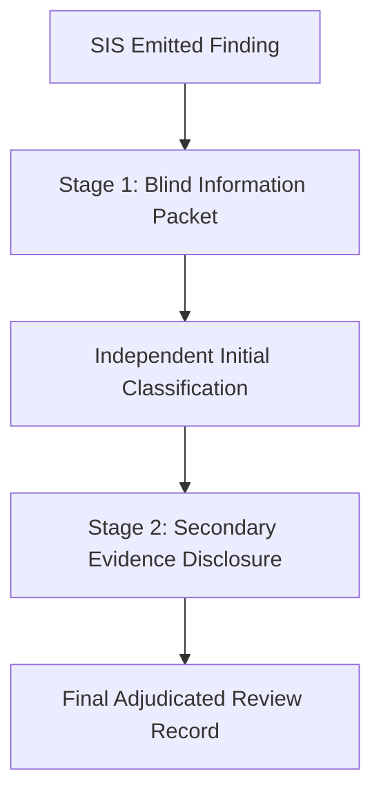

# SIS Ground-Truth Evaluation & Blind Review Protocol

## 1. Introduction & Philosophy

The credibility of static analysis and runtime verification benchmarks depends on the strict separation between **Detection** (what the tool reports) and **Ground Truth** (what an independent software engineer determines to be true about the target system).

> [!IMPORTANT]
> **Core Principle**: A finding reported by SIS is an unverified assertion until classified by an independent human reviewer. "SIS reported it" does not mean "it is a real vulnerability or defect."

This protocol defines the formal review methodology for evaluating findings emitted by SIS against real-world open-source Next.js App Router codebases. It is designed to be rigorous, reproducible, and executable by any external open-source contributor.

---

## 2. Review Workflow & Staged Evidence Disclosure

To prevent cognitive bias, reviewers must evaluate findings through a **Two-Stage Blind Review Process**:



### Stage 1: Blind Review (Initial Pass)
In Stage 1, the reviewer is presented **only** with the target code location, minimal invocation context, and reproduction steps, without SIS's internal heuristics, confidence scores, or diagnostic rationales.

**Visible to Reviewer in Stage 1**:
- Target repository and pinned commit SHA
- Target source file, line, and column numbers
- Boundary kind (e.g. Server Action or RSC Prop Boundary)
- Function signature and parameters
- Generated minimal adversarial payload (reproducer)
- Observed execution output (e.g. exception type and message inside isolate)

**Hidden from Reviewer in Stage 1**:
- SIS rule classification (e.g. `SIS001`, `SIS003`)
- SIS generated explanation text
- SIS taint trace graphs or engine provenance metadata

The reviewer independently inspects the application source at the pinned commit and answers:
> *"Does this input constitute a realistic boundary input that the application fails to handle, resulting in an unhandled crash, state corruption, or security policy violation?"*

### Stage 2: Secondary Evidence Review (Contextual Pass)
After the initial classification is recorded, the reviewer unlocks Stage 2 evidence:
- Full SIS diagnostic message and rule rationale
- Taint propagation or Flight serialization traces
- SIS execution mode (`FULL`, `PREFIX`, `STATIC_ONLY`)
- Framework prelude logs (`cookies()`, `headers()`, `redirect()`)
- Sliced prefix boundary coordinates (`verifiedPrefix`, `stoppedAt`)

The reviewer may revise their classification or upgrade/downgrade confidence based on whether the engine's interpretation aligns with real-world Next.js runtime semantics.

---

## 3. Ground-Truth Classification Taxonomy

Every reviewed finding must receive exactly one of the following canonical classifications:

| Classification | Meaning | Inclusion in Precision Denominator |
| :--- | :--- | :---: |
| **`TRUE_POSITIVE`** | **Genuine defect or vulnerability**. An adversarial payload reaches production boundary code and triggers an unhandled crash, server error, or serialization failure under valid Next.js execution semantics. | **YES** (Numerator & Denominator) |
| **`FALSE_POSITIVE`** | **Analyzer error**. SIS reported a defect, but the code is provably safe under runtime semantics, guarded by external validation, or misclassified as a server boundary when it is client-only code. | **YES** (Denominator only) |
| **`FRAMEWORK_ARTIFACT`** | **Sandbox or harness limitation**. The finding was caused by the analysis harness or sandbox environment itself (e.g. missing Node.js host global in zero-privilege isolate, unmocked cloud SDK singleton) rather than an application bug. | **NO** (Tracked in Artifact Rate) |
| **`UNREACHABLE`** | **Dead code**. The reported function or boundary is not exposed via Next.js routing, is inside an orphaned test utility, or cannot be invoked over HTTP. | **NO** (Tracked in Unreachable Rate) |
| **`EXPECTED_BEHAVIOR`** | **Design intent**. The application intentionally terminates (e.g. calling `redirect()`, `notFound()`, or throwing an intentional authentication rejection). | **NO** (Not a defect) |
| **`NEEDS_REVIEW`** | **Ambiguous / Insufficient Evidence**. Requires domain expertise, database schema inspection, or live staging reproduction. | **NO** (Excluded from metrics) |

---

## 4. Confidence Levels

Every review record must declare a confidence rating:

- **`HIGH`**: Provable by direct source inspection or reproducible via a standalone Node.js/Next.js script. Absolute certainty regarding framework semantics and input reachability.
- **`MEDIUM`**: Strong circumstantial evidence, but full verification depends on complex unbundled module state, database constraints, or middleware not fully represented in the file.
- **`LOW`**: Ambiguous intent; classification is based on heuristic plausibility.

---

## 5. Review Record Schema

All review decisions must be stored in `benchmarks/reviews/ground-truth.json` adhering to the following schema:

```json
{
  "fingerprint": "b6bbfce3dbe171b5",
  "repository": "vercel/commerce",
  "commit": "3761e52e60df9c6a316e067dbfd7032e494d3634",
  "file": "components/cart/actions.ts",
  "line": 48,
  "column": 10,
  "ruleId": "SIS003",
  "actionName": "updateItemQuantity",
  "stage1Classification": "TRUE_POSITIVE",
  "stage1Notes": "Direct property access payload.merchandiseId crashes when payload is null.",
  "classification": "TRUE_POSITIVE",
  "confidence": "HIGH",
  "reviewer": "reviewer-alice",
  "reviewDate": "2026-09-12T00:00:00.000Z",
  "rationale": "Action is an exported 'use server' mutation. Passing an empty payload object triggers an unhandled TypeError inside the prefix validation logic.",
  "evidence": {
    "reproductionVerified": true,
    "frameworkContextChecked": true
  }
}
```

---

## 6. Inter-Rater Reliability & Adjudication

Where two reviewers are available:
1. **Independent Review**: Reviewer A and Reviewer B independently evaluate a randomized 20% sample of findings without access to each other's notes.
2. **Agreement Metric**: Compute Cohen's Kappa ($\kappa$) across the binary classification (`TRUE_POSITIVE` vs other):
   $$\kappa = \frac{p_o - p_e}{1 - p_e}$$
3. **Disagreement Adjudication**: When Reviewer A and Reviewer B disagree (e.g. `TRUE_POSITIVE` vs `FALSE_POSITIVE`):
   - The finding is flagged for joint adjudication.
   - Both reviewers meet with an engineering lead to inspect Next.js internal source specifications.
   - If consensus cannot be reached, the finding is conservatively classified as `NEEDS_REVIEW` or `FALSE_POSITIVE`.

> [!NOTE]
> When only a single reviewer is available, inter-rater reliability cannot be claimed. In such cases, the report must state:  
> *"All classifications were evaluated by a single expert reviewer; inter-rater agreement was not measured."*

---

## 7. Metrics & Statistical Definitions

### Emitted Precision (Binary TP/FP)
Precision measures the correctness of findings that represent actionable defects:
$$\text{Precision} = \frac{\text{TRUE\_POSITIVE}}{\text{TRUE\_POSITIVE} + \text{FALSE\_POSITIVE}}$$

### Framework-Artifact Rate
Measures how cleanly the execution harness isolates real application code:
$$\text{Artifact Rate} = \frac{\text{FRAMEWORK\_ARTIFACT}}{\text{Total Reviewed Findings}}$$

### Review Coverage
Measures the completeness of the ground-truth audit:
$$\text{Review Coverage} = \frac{\text{Reviewed Findings}}{\text{Emitted Findings}}$$

### Action Coverage
$$\text{Action Coverage} = \frac{\text{Actions Analyzed}}{\text{Actions Discovered}}$$

### Runtime Verification Rate
$$\text{Verification Rate} = \frac{\text{Actions Run in FULL or PREFIX Mode}}{\text{Actions Discovered}}$$

### Recall Policy
> [!WARNING]
> **Do NOT Calculate Recall**. SIS does not claim or compute a "recall" percentage for benchmark repositories.  
> **Explicit Standard Statement**: *"Recall is not estimated because the complete set of latent defects in uninstrumented real-world codebases is unknown."*

---

## 8. Negative Sampling Protocol

To guard against silent analyzer blind spots and false negatives, reviewers must audit **Negative Samples** (locations where SIS did *not* emit a finding):

1. **Static-Only Sample**: 10% of Server Actions classified as `STATIC_ONLY` due to external dependencies.
   - *Audit Question*: Did the action contain a verifiable input validation prefix that the engine failed to identify?
2. **Unsupported Global Sample**: Actions stopped by `UNSUPPORTED_HOST_GLOBALS`.
   - *Audit Question*: Was the global identifier locally shadowed or mocked in a way that was safe to execute?
3. **Complex Prop Boundary Sample**: Server-to-Client component boundaries with complex object props where no `SIS002` was emitted.
   - *Audit Question*: Did an un-serializable value (e.g. Date, class instance, function) cross the boundary undetected?
4. **Route Handler Sample**: Route Handlers that were excluded from RSC Flight serialization checks.
   - *Audit Question*: Did the route handler expose internal server secrets in violation of `SIS001`?

---

## 9. Limitations & Caveats

1. **Source vs Environment**: Static and prefix-isolated analysis cannot replicate full production infrastructure (e.g. real database state, external OAuth providers, distributed Redis clusters).
2. **Single-Reviewer Risk**: Human review carries subjective interpretation regarding what constitutes an "acceptable" crash vs an "application defect" on malformed HTTP inputs.
3. **Corpus Selection Bounds**: High precision on a curated set of 20 repositories does not guarantee equivalent precision on legacy or non-standard Next.js architectures.
