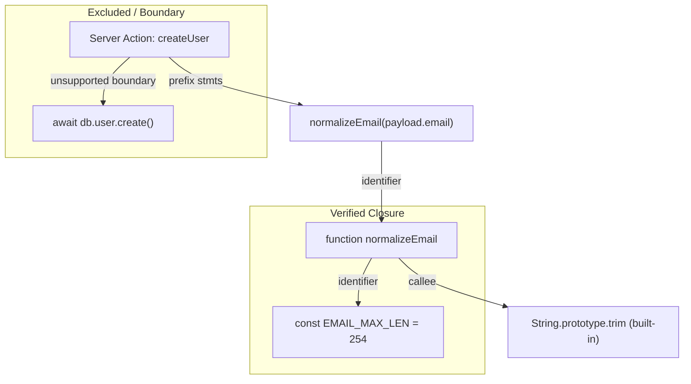

# Phase 26 — Dependency-Aware Prefix Verification
## Architecture, Threat-Model & Design Specification

> **Status**: Architecture & Threat-Model Design ONLY  
> **Target Version**: SIS 0.2.0 (Phase 26 Proposal)  
> **Prerequisites**: Phase 25 (Selective Runtime Verification) & Phase 25.5 (Adversarial Regression Validation)  
> **Author**: SIS Core Architecture Group  
> **Date**: September 2026  

---

## 1. Problem Statement

In Phase 25 and Phase 25.5, SIS introduced **Selective Runtime Verification** (`PREFIX` execution mode). Under this architecture, when an exported Server Action contains input validation and sanitization statements prior to reaching an unsupported boundary (e.g. database operations, cloud SDKs, or external network services), SIS extracts the safe statement prefix into an isolated V8 isolate (`isolated-vm`), runs deterministic fuzz payloads, and verifies that the prefix does not suffer from unhandled runtime exceptions (`SIS003`).

Currently, `extractCandidateFunction` isolates **only the target Server Action AST node** into a standalone module. Consider the following common real-world pattern:

```ts
"use server";

function normalizeEmail(email: string): string {
  return email.trim().toLowerCase();
}

const EMAIL_MAX_LEN = 254;

export async function registerUser(payload: { email: string }) {
  const email = normalizeEmail(payload.email);
  if (email.length > EMAIL_MAX_LEN) {
    throw new Error("Email too long");
  }

  await db.user.create({ data: { email } });
}
```

In the current engine:
1. `analyzeActionPrefix` identifies statement 0 (`const email = normalizeEmail(...)`) and statement 1 (`if (email.length ...)`) as free of unsupported host globals or external imports.
2. Statement 2 (`await db.user.create(...)`) references `db` (`UNSUPPORTED_HOST_GLOBALS`), establishing a prefix boundary at index 2.
3. The candidate function body is sliced to statements `[0..1]`, and synthesized with a return sentinel.
4. When the candidate is compiled and run inside `isolated-vm`, `normalizeEmail` and `EMAIL_MAX_LEN` are missing from the isolate scope.
5. V8 throws `ReferenceError: normalizeEmail is not defined`.
6. SIS catches this unhandled `ReferenceError` and conservatively classifies the execution as `status: "unsupported"`.

### The Core Tension
- **Fail-Closed Safety (Current)**: The current behavior is completely safe and sound. It never reports a spurious application bug when a module helper is missing.
- **Coverage Limitation**: Valid, deterministically verifiable prefix logic is bypassed because the helper function declared in the exact same file is not recovered into the candidate execution context.

**Phase 26 Objective**: Define the architectural model, dependency taxonomy, syntactic purity rules, and threat boundaries required to safely recover deterministic module-local dependencies without compromising the 100% precision baseline established in Phases 22–25.5.

---

## 2. Core Principles

1. **Precision Over Coverage**: The objective of dependency recovery is **never** to "execute more code" at any cost. The objective is to execute additional code **only when SIS can prove that the code is deterministic, side-effect-free, and self-contained within the verified boundary**.
2. **Conservative Fail-Closed Rule**: Whenever dependency purity, closure safety, or evaluation side effects cannot be proven with 100% syntactic certainty:
   $$\text{STATIC\_ONLY} > \text{unsound execution}$$
   $$\text{unsupported} > \text{speculative failure}$$
3. **No Guessing**: The analysis must operate strictly on explicit, provable AST semantics. If any identifier, initializer, or call is ambiguous, the engine must immediately halt dependency recovery and fall back to `STATIC_ONLY` or current prefix behavior.
4. **Hermetic Zero-Privilege Guarantee**: No recovered dependency may ever bridge or access host privileges (`process`, `fs`, `network`, `timers`, external modules, or mutable globals).

---

## 3. Dependency Taxonomy

Any identifier referenced within a candidate prefix that is not a parameter, local variable, or supported framework prelude must be classified into one of the following 12 dependency classes:

| Class | Category | Example | Eligible for Recovery? | Required Guarantee |
| :--- | :--- | :--- | :---: | :--- |
| **A** | **Pure Local Function** | `function norm(x) { return x.trim(); }` | **YES** | Proven pure body, pure parameters, no free variables outside closure. |
| **B** | **Pure Local Constant** | `const MAX_LEN = 254;` | **YES** | Initializer is a primitive literal or pure literal expression. |
| **C** | **Constant from Constant** | `const PREFIX = "u_"; const K = PREFIX + "id";` | **YES** | Transitive initializer dependency chain is 100% pure and cycle-free. |
| **D** | **Mutable Module State** | `let counter = 0; function inc() { return ++counter; }` | **NO** | Disqualified. Mutating or reading shared module state breaks determinism. |
| **E** | **External Module Import** | `import { slugify } from "./utils";` | **NO** | Disqualified. Cross-file resolution requires bundling and crosses file boundary. |
| **F** | **Cloud / DB Dependency** | `import { db } from "@/lib/db";` | **NO** | Disqualified. Unconditionally unsupported. |
| **G** | **Environment Access** | `const REGION = process.env.REGION;` | **NO** | Disqualified. Host global leakage. |
| **H** | **Side-Effectful Helper** | `function log(x) { console.log(x); return x; }` | **NO** | Disqualified. Non-deterministic I/O or global state access. |
| **I** | **Direct Recursion** | `function fact(n) { return n <= 1 ? 1 : n * fact(n-1); }` | **NO** | Disqualified in initial model. Poses stack overflow / timeout risk. |
| **J** | **Mutual Recursion** | `function a() { b(); } function b() { a(); }` | **NO** | Disqualified. Cycle in dependency graph. |
| **K** | **Class / Class Instance** | `class Validator { ... } const v = new Validator();` | **NO** | Disqualified. Prototype mutations and stateful methods introduce unpredictability. |
| **L** | **Module Closure Capture** | `const pfx = process.env.PFX; function get(x) { return pfx + x; }` | **NO** | Disqualified. Free variables capture unverified outer scope. |

---

## 4. Syntactic Purity Model

To determine whether a Class A or Class B/C dependency is pure, SIS must evaluate its AST against a formal syntactic verification specification.

### Proposed Classification States
```text
  ┌─────────────────────────────────────────────────────────┐
  │                   Dependency Analysis                   │
  └────────────────────────────┬────────────────────────────┘
                               │
            ┌──────────────────┴──────────────────┐
            ▼                                     ▼
   [ Syntactically Pure ]               [ Impure / Ambiguous ]
            │                                     │
    ┌───────┴───────┐                    ┌────────┴────────┐
    ▼               ▼                    ▼                 ▼
  PURE       PURE_WITH_CONSTANTS   UNSAFE_MUTATION   EXTERNAL_DEP
                                   UNSUPPORTED_GLOBAL  UNKNOWN
```

### Formal Proof Rules for PURE Helper Functions
A function declaration $F$ is classified as `PURE` if and only if all of the following conditions hold:

1. **Parameters ($P$)**:
   - Every parameter $p \in P$ is an `Identifier` or pure `ObjectPattern` / `ArrayPattern`.
   - Any default parameter expression $p_{\text{default}}$ must evaluate strictly to a primitive literal (`StringLiteral`, `NumericLiteral`, `BooleanLiteral`, `NullLiteral`). Function calls or identifier lookups in default parameters are strictly forbidden.
   - Rest parameters (`...rest`) are permitted only if rest elements are treated immutably.
2. **Body Statements ($B$)**:
   - Body must be a `BlockStatement` or single expression (concise arrow body).
   - Prohibited statements: `WithStatement`, `DebuggerStatement`, `LabeledStatement`, `TryStatement` (in initial phase), `ForInStatement`, `ForOfStatement`, `WhileStatement`, `DoWhileStatement` (loops create termination-proof requirements).
3. **Identifier Resolution (Free Variables)**:
   - For every identifier $v$ referenced in $F$:
     - $v$ must be a declared parameter in $P$, OR
     - $v$ must be a local variable declared within $F$ prior to its use, OR
     - $v$ must be a whitelisted safe JavaScript built-in (see Section 10), OR
     - $v$ must resolve to a sibling `PURE` function or `PURE_WITH_CONSTANTS` declaration in the same module dependency graph.
4. **Calls**:
   - Any call expression $e_{\text{callee}}(args)$ must have its callee resolve to:
     - A verified `PURE` helper in the same dependency closure, OR
     - An approved built-in prototype method on a primitive (e.g. `String.prototype.trim`, `String.prototype.toLowerCase`, `Array.prototype.slice`).
   - Dynamic calls (`callee[expr]()`, `eval()`, `new Function()`) are strictly forbidden.
5. **Mutation & Assignments**:
   - Zero assignments to module-scoped variables (`x = ...`).
   - Zero property mutations (`obj.prop = ...`, `delete obj.prop`).
   - Zero mutating unary operators (`++`, `--`) on non-local identifiers.
   - Allowed: local variable declarations (`const x = ...; let y = ...;`) mutated only within the local execution frame of $F$.
6. **Object / Array Instantiation**:
   - Object literals `{ key: val }` are permitted if all keys are static identifiers and all values are pure expressions.
   - Computed property keys (`{ [expr]: val }`) and getters/setters are prohibited (see Section 11).

---

## 5. Dependency Graph & Transitive Closure Design

### Graph Representation
Let the module AST be represented as a set of top-level declarations $\mathcal{D} = \{ d_1, d_2, \dots, d_m \}$.  
Let the target Server Action be $A \in \mathcal{D}$.  
The prefix statement slice is $S_{\text{prefix}} = [ s_0, s_1, \dots, s_{k-1} ]$.

1. **Seed Set**:
   Extract all free identifiers $\mathcal{I}_0$ referenced within $S_{\text{prefix}}$ that are not bound within $A$'s parameters or preceding statements:
   $$\mathcal{I}_0 = \text{FreeVars}(S_{\text{prefix}}) \setminus (\text{Params}(A) \cup \text{Locals}(S_{\text{prefix}}) \cup \text{Preludes})$$

2. **Graph Construction**:
   Construct directed graph $G = (V, E)$ where:
   - $V \subseteq \mathcal{D}$
   - Directed edge $(u, v) \in E$ indicates that declaration $u$ references identifier declared by $v$.

3. **Cycle Detection & Bounded Depth**:
   - Traversal algorithm: Depth-First Search with 3-color node state:
     - `WHITE`: unvisited
     - `GRAY`: currently in recursion stack (active path)
     - `BLACK`: fully verified and resolved
   - **Back-edge rule**: Encountering a `GRAY` node indicates recursion ($u \to \dots \to u$). Any cycle immediately halts traversal; the action is rejected for dependency recovery and falls back to `STATIC_ONLY`.
   - **Maximum Depth**: Transitive dependency depth is bounded to $D_{\max} = 3$. If the dependency chain exceeds length 3, recovery is aborted.

4. **Deterministic Topological Sorting**:
   Dependencies in the closure must be emitted in reverse topological order (dependencies declared before dependents) to guarantee deterministic evaluation upon module execution.



---

## 6. Scope Resolution Rules

| Scope Level | Syntactic Construct | Eligible for Recovery? | Rationale |
| :--- | :--- | :---: | :--- |
| **Top-Level Module Scope** | `function f() {}` or `const C = ...` | **YES** | Clear static lifecycle, non-ephemeral, inspectable in module AST. |
| **Action Function Scope** | Local variable inside action body | **N/A** | Already preserved directly inside prefix statement slice. |
| **Block Scope** | `{ const temp = ... }` inside module | **NO** | Block-scoped declarations outside functions indicate script initialization blocks. |
| **Closure Scope** | Factory returning functions closing over outer mutable state | **NO** | Cannot statically guarantee encapsulated state remains immutable across invocations. |
| **Imported Scope** | `import { x } from './utils'` | **NO** | Requires multi-file AST resolution, module loaders, and bundle virtualization. |

---

## 7. Candidate Extraction Design Options

Four architectural options were evaluated for bringing recovered dependencies into isolated execution:

```text
Option A: AST Inlining
  Replace call `normalizeEmail(x)` with inlined block `{ const email = x.trim(); ... }`

Option B: Dependency Cloning
  Clone helper AST node into same module body alongside the action.

Option C: Topologically Sorted Dependency Closure Packaging
  Emit a dedicated, clean synthetic ES2022 module containing:
    1. Deterministic framework preludes
    2. Recovered constants (topologically ordered)
    3. Recovered pure functions (topologically ordered)
    4. Sliced candidate action function with sentinel return

Option D: Rejection of All Non-Trivial Dependencies (Status Quo)
  Only allow actions whose prefixes have zero free variables outside parameters and preludes.
```

### Comprehensive Comparison Matrix

| Evaluation Dimension | Option A (AST Inlining) | Option B (Dependency Cloning) | Option C (Closure Packaging) | Option D (Status Quo) |
| :--- | :---: | :---: | :---: | :---: |
| **Semantic Fidelity** | Poor (breaks `return`, `arguments`) | Moderate | **High** | High (fails closed) |
| **Implementation Complexity** | Extremely High | Low | **Moderate** | Zero |
| **Source Location Mapping** | Lost / Distorted | Preserved | **Preserved via source maps** | Preserved |
| **Recursion Handling** | Inapplicable (expands indefinitely) | Rejects | **Rejects deterministically** | Rejects |
| **Name Collision Risk** | High (scope pollution) | Moderate | **Low (scoped to module)** | None |
| **Determinism** | High | High | **High** | High |
| **Provenance Tracking** | Obscured | Explicit | **Exact & Declarative** | Declarative |
| **Shrinker Compatibility** | Fragile | Compatible | **100% Compatible** | 100% Compatible |
| **Soundness Risk** | High | Low | **Zero (fails closed)** | Zero |

### Recommendation
**Adopt Option C (Dependency Closure Packaging)** restricted by the strict syntactic purity subset defined in Section 4.  
Option C preserves native JavaScript calling semantics, keeps line/column mappings clean for SARIF diagnostics, allows trivial provenance reporting, and prevents the complex variable renaming and control-flow rewriting bugs inherent to AST inlining.

---

## 8. Critical Semantic Issues & Soundness Proofs

### 8.1 Function Identity & Aliasing
- **Problem**:
  ```ts
  const helper = function(val) { return val.trim(); };
  const alias = helper;
  export async function action(payload) { return alias(payload.val); }
  ```
- **Rule**: Identifier resolution must trace variable initializers. If `alias` is initialized to another identifier `helper`, the resolver must inspect the right-hand side, resolve `helper`, and confirm that neither identifier is re-assigned (`const` declaration only). Any dynamic alias assignment (`let alias; if (...) alias = f1; else alias = f2;`) immediately disqualifies the dependency.

### 8.2 Side-Effect Detection
- **Problem**:
  ```ts
  function helperA(val) { globalThis.state = val; return val; }
  function helperB(val) { externalArray.push(val); return val; }
  function helperC(val) { fetch("/log"); return val; }
  ```
- **Rule**:
  - `globalThis`, `window`, `global` access: Instantly flagged as `UNSUPPORTED_GLOBAL`.
  - Member assignment `target.prop = val`: Disqualified unless `target` is provably created within the same local activation record.
  - Method calls on free variables (`externalArray.push`): Disqualified. Only whitelisted pure methods on local instances are allowed.

### 8.3 Safe Built-in Whitelist
A minimal, immutable whitelist of JavaScript built-ins is permitted:
- `String.prototype`: `trim`, `trimStart`, `trimEnd`, `toLowerCase`, `toUpperCase`, `slice`, `substring`, `charAt`, `charCodeAt`, `startsWith`, `endsWith`, `includes`, `indexOf`, `replace` (with string literal argument).
- `Array.prototype`: `slice`, `concat`, `includes`, `indexOf`, `join`. (Mutating methods `push`, `pop`, `shift`, `unshift`, `splice`, `reverse`, `sort` are **prohibited**).
- `Number`: `isInteger`, `isNaN`, `isFinite`, `parseInt`, `parseFloat`.
- `Math`: `min`, `max`, `abs`, `floor`, `ceil`, `round`. (`Math.random` is **strictly prohibited** due to non-determinism).
- `JSON`: `stringify`, `parse` (when wrapped in pure try/catch).
- `Object`: `keys`, `values`, `entries` on pure local objects.

### 8.4 Getters and Computed Properties
- **Problem**:
  ```ts
  const obj = {
    get secret() { return db.getSecret(); }
  };
  const key = computeDynamicKey();
  const map = { [key]: payload.value };
  ```
- **Rule**:
  - Object literals with getter/setter accessors (`get prop()`, `set prop()`) cannot be verified syntactically as pure constants. They are classified as `UNKNOWN` and rejected.
  - Computed property keys (`[expr]`) require evaluation. Unless `expr` is a compile-time constant string or number literal, the object is rejected.

### 8.5 Parameter Default Values in Helpers
- **Rule**: The default-parameter invariant validated in Phase 25.5 applies recursively to all helpers:
  ```ts
  function helper(val = db.getDefault()) { return val.trim(); }
  ```
  Even if the body of `helper` is pure, `scanNodeDependencies` traverses the parameter default AST. The presence of `db` immediately classifies `helper` as `UNSUPPORTED_GLOBAL`, preventing it from entering the dependency closure.

### 8.6 Mutations
- **Rule**: Pure functional immutability is favored. Modifying argument references (`payload.prop = ...`) mutates the caller's reference. In Phase 25.5B, we verified payload isolation via `ExternalCopy`. However, within helper functions, in-place mutation of parameters is prohibited to maintain referential transparency.

### 8.7 Exceptions Inside Helpers
- **Problem**:
  ```ts
  function validate(val) {
    if (!val) throw new Error("Invalid value");
    return val.trim();
  }
  ```
- **Rule**: Deterministic exceptions are **safe**. An invariant violation triggered by an explicit `throw` on malformed inputs is a legitimate verification finding (or expected input rejection). The engine distinguishes controlled application throws from unexpected runtime crashes (e.g. `Cannot read properties of undefined`). A helper that throws does not make the helper impure, provided the throw expression is deterministic.

---

## 9. Security Boundary Analysis

Under no circumstance may dependency recovery create a side-channel or escape hatch across the isolation boundary:

```text
                  ISOLATION BOUNDARY
  Host Context (Node.js)      │  Isolate Context (isolated-vm)
 ─────────────────────────────┼────────────────────────────────
  process.env.*               │  [BLOCKED]
  Database Pool / Clients     │  [BLOCKED]
  Cloud SDKs (AWS, Stripe)    │  [BLOCKED]
  Network / Sockets           │  [BLOCKED]
  Filesystem                  │  [BLOCKED]
                              │
  Local Pure Helpers          │──> Extracted via SWC AST
  Local Pure Constants        │──> Copied into Isolated Module
  Deterministic Preludes      │──> Injected Mock Harness
```

### Transitive Contamination Rule
If declaration $D_1$ is pure, but references $D_2$, and $D_2$ references an environment variable or cloud SDK:
$$D_2 \in \text{Unsupported} \implies D_1 \in \text{Unsupported} \implies \text{Closure Rejected}$$
Contamination is strictly transitive. A helper can never be partially recovered if any link in its dependency chain is unverified.

---

## 10. Provenance & Diagnostics Schema Extension

To ensure complete transparency, the `RuntimeProvenance` interface should be extended (conceptually for Phase 26) as follows:

```ts
export interface RuntimeProvenance {
  readonly mode: ExecutionMode;
  readonly preludesUsed?: string[];
  readonly verifiedPrefix?: PrefixBoundary;
  readonly stoppedAt?: StoppedAt;
  
  // Phase 26 Proposed Additions
  readonly dependencyClosure?: {
    readonly recoveredIdentifiers: string[];
    readonly policy: "NONE" | "PURE_LOCAL_ONLY";
    readonly maxDepth: number;
  };
  readonly rejectedDependencies?: Array<{
    readonly identifier: string;
    readonly reason: "mutable-state" | "external-import" | "cycle" | "impure-call" | "unsupported-global";
    readonly line?: number;
  }>;
}
```

---

## 11. Shrinking Implications

1. **Payload Shrinking Invariance**: Input shrinking (reducing a failing payload to its minimal reproducer via `fast-check`) executes the candidate function repeatedly with smaller inputs.
2. **Determinism Requirement**: Because the dependency closure is constructed purely from immutable AST declarations and deterministic preludes, the candidate module behaves as a pure mathematical function of the input payload.
3. **Reproducibility**: Shrinking produces identical counterexamples whether executed against an isolated action or a dependency-closed action, provided dependencies are side-effect-free.

---

## 12. Benchmark Impact Projection

We empirically audited the 20 Server Actions across the 5 pinned repositories in the benchmark corpus:

| Repository | Server Actions Discovered | Current Status (Phase 25.5) | Would Phase 26 Increase Runtime Coverage? | Reason / Blockers |
| :--- | :---: | :---: | :---: | :--- |
| **shadcn-ui/taxonomy** | 0 | Completed (no actions) | No | No Server Actions exist in target files. |
| **leerob/site** | 0 | Completed (no actions) | No | Uses direct Route Handlers / DB queries. |
| **vercel/commerce** | 5 | 9 Findings (1 FULL, 1 PREFIX, 3 STATIC_ONLY) | **No** | The 9 confirmed TPs in `updateItemQuantity` already execute under FULL mode. The remaining cart actions call Shopify SDK client (`import { shopifyFetch }`) at statement 0. |
| **dubinc/dub** | 11 | 11 STATIC_ONLY | **No** | All 11 actions immediately invoke `@/lib/upstash` (`ratelimit`), `@ai-sdk`, or `prisma` at statement 0. These are external singletons locked to STATIC_ONLY to prevent framework artifacts. |
| **mickasmt/next-saas-stripe-starter** | 4 | 4 STATIC_ONLY | **No** | Actions immediately call `stripe.checkout.sessions.create` or `prisma.user.update`. |

### Key Empirical Finding
Across the entire 5-repository benchmark corpus, **zero Server Actions are currently blocked by module-local helper functions**. Every action that currently falls back to `STATIC_ONLY` does so because of direct external cloud dependencies (`@upstash/ratelimit`, `stripe`, `prisma`, `@ai-sdk/rsc`) or parameter-level `FormData` requirements.

Therefore, implementing complex dependency recovery would have **0% impact on the current real-world benchmark finding count or coverage**, while introducing significant architectural complexity and potential surface area for soundness bugs.

---

## 13. Adversarial Test Matrix (Planned for Phase 26)

If implemented, the test suite must enforce the following matrix:

```text
├── Safe Category (Should execute in PREFIX mode)
│   ├── Pure local helper (string manipulation)
│   ├── Pure local constant (primitive literal)
│   ├── Transitive pure helper chain (A -> B -> C)
│   ├── Helper with deterministic throw
│   └── Helper using whitelisted built-ins (String.prototype.trim)
│
├── Unsafe Category (Must fail closed to STATIC_ONLY / unsupported)
│   ├── Helper referencing process.env
│   ├── Helper referencing db / prisma / redis
│   ├── Helper with mutating operator on module variable
│   ├── Helper calling console.log / Math.random
│   ├── Helper with external import reference
│   ├── Helper with computed property key
│   ├── Helper with impure parameter default
│   ├── Recursive function (direct)
│   └── Cyclic mutual recursion (A -> B -> A)
│
├── Scope & Shadowing Category
│   ├── Helper shadowing host global name (must fail closed)
│   ├── Local variable shadowing helper name
│   └── Function-scoped vs module-scoped declarations
```

---

## 14. Decision Gate & Recommendation

Three strategic options were considered:

- **OPTION A — Full Dependency Recovery**: Implement full AST dependency resolution, closure packaging, and multi-statement dependency tracking in Phase 26.
- **OPTION B — Restricted Micro-Subset**: Implement only top-level primitive constants (`const X = "literal"`) and single-expression pure helpers (`const f = (x) => x.trim()`).
- **OPTION C — Defer Implementation (Maintain Fail-Closed Precision)**: Preserve the existing, proven fail-closed model (`ReferenceError` $\to$ `unsupported`) without adding dependency recovery to the runtime engine.

### Recommendation: **OPTION C (with Option B as a future specification reference)**

### Rationale:
1. **Empirical Evidence**: Our corpus audit reveals that 0 of the 20 benchmark Server Actions are blocked by module-local helpers. The real blockers are cloud SDKs (`@upstash/ratelimit`, `stripe`, `prisma`). Implementing dependency recovery would not convert a single benchmark action from `STATIC_ONLY` to verified execution.
2. **Maintenance & Soundness Risk**: JavaScript's dynamic nature (prototypes, getters, lexical closures, hoisting, aliasing) makes proving syntactic purity notoriously complex. An edge case could allow stateful or external code to slip into isolated-vm, threatening our **100% precision** milestone.
3. **Engineering Efficiency**: SIS engineering effort is far better directed toward high-value invariants (e.g. CSRF/Origin validation, server action authentication boundaries, and client component taint propagation) than building a complex module bundler for isolated prefixes.

---

## 15. Open Questions for Future Phases

1. If a future corpus contains heavily modularized actions with local helper libraries, should SIS adopt SWC/esbuild bundle slicing rather than custom AST dependency tracking?
2. Can TypeScript AST type-check metadata be leveraged to soundly verify immutability (e.g. `Readonly<T>`) instead of conservative syntactic AST heuristics?
3. Should module-scoped pure constants (Class B: `const MAX = 100`) be decoupled from pure functions (Class A), allowing trivial constant inlining with near-zero soundness risk?
