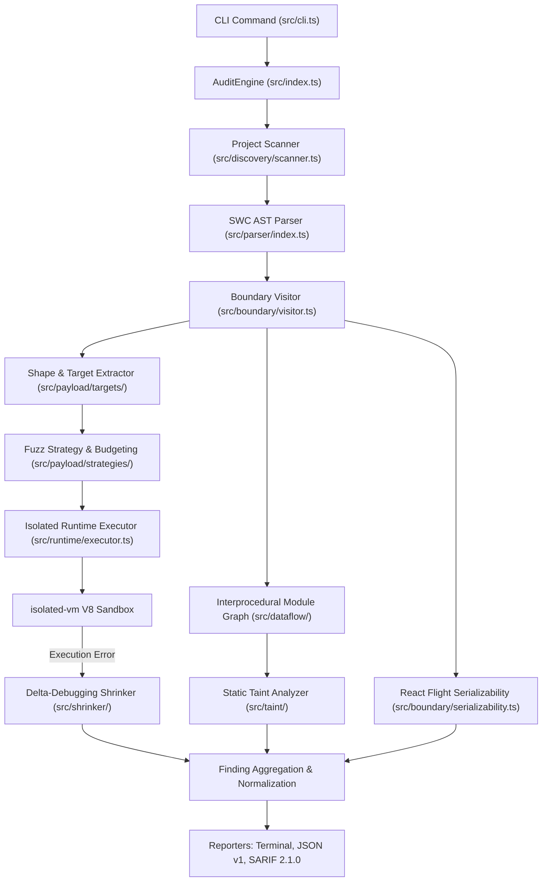

# SIS Architectural Architecture & Pipeline Specification

This document details the internal architecture, lifecycle stages, and data contracts of **SIS (Speculative Invariant Synthesis)**.

SIS is an autonomous runtime verification and speculative fuzzing engine tailored for Next.js App Router and React Server Components (RSC).

---

## 1. High-Level Pipeline

---

## 2. Component Directory Map

| Directory | Primary Module | Responsibility |
| :--- | :--- | :--- |
| `src/cli.ts` | `program` | Commander-based CLI, option parsing, input validation, and exit code management. |
| `src/index.ts` | `AuditEngine` | Central coordinator managing pipeline orchestration across single-file and directory targets. |
| `src/discovery/` | `discoverFiles` | Recursive directory traversal, default exclusion filters, deterministic sorting, and FNV-1a seed derivation. |
| `src/parser/` | `parseModule` | SWC TypeScript/TSX parsing, zero-copy source location mapping, and syntax error diagnostics. |
| `src/boundary/` | `analyzePropBoundaries` | Boundary taxonomy classification, inline directive extraction, and React Flight serializability checking. |
| `src/dataflow/` | `buildModuleGraph` | Interprocedural call-graph resolution, multi-hop export/import mapping, and depth-bounded data flow. |
| `src/taint/` | `analyzeTaint` | Sensitive environment variable tracking across assignments, destructuring, and JSX sinks. |
| `src/payload/` | `synthesizePayloads` | AST shape inference, targeted mutation strategies, and property-based adversarial input synthesis. |
| `src/runtime/` | `verifyRuntimeActions` | Execution compatibility classification, sandbox invocation in `isolated-vm`, and execution budget enforcement. |
| `src/shrinker/` | `shrinkFailurePayload` | Delta-debugging and structural minimization engine preserving exact runtime failure signatures. |
| `src/output/` | `formatJson`, `formatSarif` | Deterministic Version 1 JSON and OASIS SARIF 2.1.0 formatting. |
| `src/reporter/` | `terminal` | Compiler-grade terminal presentation, progress banners, and high-contrast error boxes. |

---

## 3. Pipeline Stages in Detail

### Stage 1: Discovery & Deterministic Seeding (`src/discovery/`)
- Recursively inspects the target directory for `.ts`, `.tsx`, `.js`, and `.jsx` files.
- Automatically excludes standard build and dependency directories (`node_modules`, `.next`, `dist`, `build`, `coverage`, `.git`) plus user-specified `--ignore` patterns.
- Sorts discovered files lexicographically to guarantee platform-independent traversal.
- Derives a per-file deterministic 32-bit seed using the FNV-1a hash algorithm combining the base `--seed` and relative file path.

### Stage 2: AST Parsing & Boundary Discovery (`src/parser/`, `src/boundary/`)
- Parses module source using `@swc/core` in TypeScript/JSX mode.
- Extracts module-level and function-level prologue directives (`"use client"`, `"use server"`).
- Classifies boundaries into:
  - `client-module`: Files marked with top-level `"use client"`.
  - `server-module`: Files marked with top-level `"use server"`.
  - `server-component`: Server-side components rendering JSX without client directives.
  - `server-action`: Definite server actions marked with top-level or inline `"use server"`.
  - `candidate-server-function`: Async exported functions in server contexts.
  - `server-to-client-props`: Props passed across Server $\to$ Client component boundaries.

### Stage 3: Interprocedural Data-Flow & Taint Analysis (`src/dataflow/`, `src/taint/`)
- Builds a local module dependency graph resolving relative imports (`./helper`, `../utils`, `./index`).
- Tracks taint propagation through function calls, return values, object property assignments, destructuring patterns, and template literal interpolations up to `--max-analysis-depth`.
- Identifies sensitive sources (`*_KEY`, `*_SECRET`, `*_TOKEN`, `*_PASSWORD`, `PRIVATE_*`) while safely ignoring public variables (`NEXT_PUBLIC_*`).
- Flags leaks reaching `"use client"` module scopes or JSX rendering contexts as `SIS001: taint-violation`.

### Stage 4: React Flight Serializability Evaluation (`src/boundary/serializability.ts`)
- Inspects props passed from Server Components into Client Components and values returned from Server Actions.
- Evaluates serializability against React Flight wire specifications:
  - **Allowed**: Primitives (`string`, `number`, `boolean`, `null`, `undefined`), `Date`, `Map`, `Set`, `ArrayBuffer`, typed arrays, plain objects, arrays, and functions with `"use server"`.
  - **Unsupported**: Unmarked closure functions, event handler callbacks, custom class instances, unregistered `Symbol()`, and circular references.
- Emits `SIS002: serialization-violation` when non-transferable data crosses the boundary.

### Stage 5: Speculative Shape Inference & Fuzz Strategy (`src/payload/`)
- Inspects candidate function parameters, TypeScript type annotations (`TsTypeLiteral`, `TsKeywordType`, `TsUnionType`), destructuring defaults, and body property accesses.
- Generates adversarial inputs across targeted categories:
  - `nullish`: `null`, `undefined`.
  - `numeric-extreme`: `0`, `-0`, `NaN`, `Infinity`, `-Infinity`, `Number.MAX_SAFE_INTEGER`.
  - `empty`: `""`, `[]`, `{}`.
  - `prototype-sensitive`: `__proto__`, `constructor`, `prototype`.
  - `deep-nested`: Recursive objects and arrays exceeding depth thresholds.
  - `serialization-trap`: Unregistered symbols, non-transferable functions, and cyclic objects.
- Budgets fuzz runs linearly: $O(T \cdot N)$ where $T$ is discovered targets and $N$ is `--runs`.

### Stage 6: Isolated Runtime Verification (`src/runtime/`)
- Evaluates candidate execution compatibility:
  - **Sandbox-Compatible**: Self-contained functions without host dependencies or unresolved external imports.
  - **Static-Only**: Functions invoking Next.js APIs (`cookies()`, `headers()`, `redirect()`, `notFound()`), database clients, or external network requests. These bypass isolate execution to prevent artificial crashes.
- Executes sandbox-compatible candidates inside a clean `isolated-vm` V8 isolate:
  - Zero host privileges: No access to `process`, `fs`, `fetch`, or host globals.
  - Strict candidate execution budget (`--timeout`, default 20ms) measured exclusively during candidate code execution.
- Captures unhandled runtime errors (`SIS003: runtime-exception`) and execution budget exhaustion (`SIS004: timeout`).

### Stage 7: Failure Shrinking & Delta Reduction (`src/shrinker/`)
- Computes a deterministic failure signature: `actionName:status:errorName:normalizedMessage`.
- Applies delta-debugging strategies:
  - Removes non-essential object keys and array items.
  - Shrinks complex values toward simpler primitives (`"string" \to ""`, `123 \to 0`, `{ a: 1, b: 2 } \to { a: 1 }`).
- Verifies every reduced candidate in the sandbox to ensure failure preservation.
- Emits the minimal reproducer payload and reduction percentage upon completion.

### Stage 8: Reporting & Output Generation (`src/output/`, `src/reporter/`)
- Formats aggregated findings into:
  - High-contrast terminal output with actionable remediation context.
  - Machine-readable Version 1 JSON schema.
  - OASIS SARIF 2.1.0 format with stable rule definitions (`SIS001` - `SIS005`).
- Maintains pure `stdout` separation in machine-readable modes with diagnostic logs directed exclusively to `stderr`.

---

## 4. Stability & Extension Guidelines

1. **Rule Identifiers**: All finding types map to immutable IDs (`SIS001` - `SIS005`). Never re-use or re-order existing IDs.
2. **Deterministic Traversal**: All directory and property traversals must be sorted lexicographically before seeding.
3. **Execution Safety**: Dynamic execution must only occur within `isolated-vm` isolates with explicit timeouts and resource bounds. Never evaluate candidate code on the host Node.js runtime.
